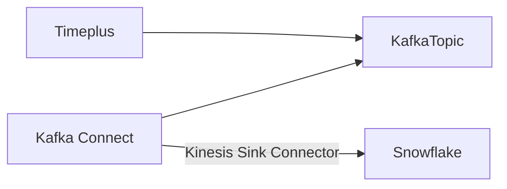
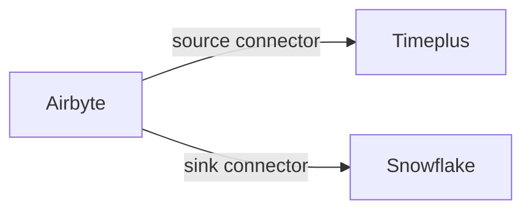

#  Sink

With Timeplus Console, you can easily explore and analyze streaming data, with intuitive UI, standard SQL and streaming charts. But you won't stop here. Timeplus enables you to send real-time insights to other systems, either to notify individuals or power up downstream applications.

## Notify others via Email or Slack

After you start running a streaming query, you can click the icon to send real-time results to other systems.

### Slack

You need to create a Slack incoming webhook so that Timeplus can send a slack message in the specific channel for each result. Please follow the [Slack documentation](https://api.slack.com/messaging/webhooks) for the instructions.

Once you've got the Slack webhook URL, you can specify it in the dialog and set a message body. You can refer to the column name via the `{{.column}}` expression. For instance, assume the output of the query is

| time                    | number | note |
| ----------------------- | ------ | ---- |
| 2022-01-23 10:00:00.123 | 50     | foo  |
| 2022-01-23 10:05:00.123 | 95     | Bar  |

You can set the message body to be `The sensor data at {{.time}} is {{.number}}, with note: {{.note}}`

### Email

You can configure Timeplus to send an email for each result by specifying the email server, user name, password, etc. Similar to the Slack action, you can refer to the value for each column using the `{{.column}}` expression.

## Send Data to Kafka{#kafka}

You can leverage Timeplus for various streaming analysis, such as

* Downsample the data from iot devices and get min/max/avg values every 5 second
* Identify any outlier based on the past pattern
* transform the data by removing sensitive information, remove duplication, or apply lookup with dimension tables

The transformed data or outlier events can be sent to a Kafka topic for other systems to further process.

To send data to Kafka, submit a streaming query, then click the icon to send streaming results to Kafka. The following parameters are required:

* Kafka broker(s) URL
* Topic name: either an existing topic or specify the new topic name for Timeplus to create.
* Authentication

Please refer to the [Kafka source](ingestion#kafka) for details of the parameters. You can send data to Confluent Cloud, Confluent Platform, or custom managed Apache Kafka. The events will be encoded as JSON documents.

## Send Data to Snowflake{#snowflake}

You can apply streaming analysis in Timeplus, then send the results to Snowflake. There are a few different ways to make it happen:

1. You can send the streaming results to Confluent Cloud or Kafka. Then leverage the [Snowflake sink in Confluent Cloud](https://docs.confluent.io/cloud/current/connectors/cc-snowflake-sink.html) to move the data into Snowflake. This approach will achieve lower latency. Please note the Confluent Cloud Kafka cluster needs to reside in the same cloud vendor and region, for example, both of them in us-west-1 of AWS. By default, the table in Snowflake will be created with the same name of the Kafka topic and the JSON document is saved in a TEXT column `RECORD_CONTENT`



For example, the query to downsample the data in Timeplus is

```sql
select window_end as time,cid,avg(speed_kmh) as speed_kmh,max(total_km) as total_km,
avg(gas_percent) as gas_percent,min(locked) as locked,min(in_use) as in_use 
from tumble(car_live_data,2s) group by cid, window_end
```

Then create a Kafka sink to send such data to the topic: snowflake.

After setting up the sink connector in Confluent Cloud, a `snowflake` table will be created with the specified database and schema in your snowflake environment.  Then you can create a view to flatten the JSON document, such as

```sql
create view downsampled as select RECORD_CONTENT:time::timestamp_tz as time,
RECORD_CONTENT:cid as cid, RECORD_CONTENT:gas_percent as gas_percent,
RECORD_CONTENT:in_use as in_use,RECORD_CONTENT:locked as locked,
RECORD_CONTENT:speed_kmh as speed_kmh,RECORD_CONTENT:total_km as total_km from snowflake
```


2. You can also use other data integration tools to move data. For example, using AirByte to load the latest data from Timeplus table, then move them to Snowflake or other destinations. 



:::info

The Timeplus source plugin for Airbyte is in the early stage. Please contact us to arrange the integration. 

:::

## Trigger Actions via webhook{#webhook}

You can also add automations to trigger other systems to take actions when Timeplus finds any real-time insights. Simply choose the **Webhook** as the action type and optionally set a message body (by default, the entire row will be encoded as a JSON document and sent to the webhook). You can use this approach to perform rule-based automation without human interaction, such as swapping a overheated equipment, scaling up to scaling down the server farm, or reminder users on slack, etc. Please check [this blog](https://www.timeplus.com/post/build-a-real-time-security-app-in-3-easy-steps) for real-world examples.


## Sink API
If you need to call an API to create a sink, here are the references.

### kafka

refer to [https://kafka.apache.org/](https://kafka.apache.org/)

| Property                | Required    | Description                                               | Default |
|-------------------------|---------|-----------------------------------------------------------|---------|
| brokers                   | yes | Specifies the list of broker addresses. This is a comma-separated string. such as `kafka1:9092,kafka2:9092,kafka3:9092`| | |
| topic                     | yes | Specifies the Kafka topic to send data to              | |
| batch_count               | no  | Specifies the number of event in each batch            |`1000`|
| data_type                 | no | Specifies the data type to use for creating the stream.   support `json`| | 
| sasl                      | no  | Specifies the Simple Authentication and Security Layer (SASL) mechanism for authentication. support `none`,`plain`,`scram-sha-256`,`scram-sha-512` | `none` | |
| username                  | no  | Specifies the username for authentication               ||
| password                  | no  | Specifies the password for authentication               ||
| tls.disable               | no  | If set to `true`, disables TLS encryption               |`false`|
| tls.skip_verify_server    | no  | If set to `true`, skips server certificate verification when using TLS |`false`|


### http

| Property                | Required    | Description                                               | Default |
|-------------------------|---------|-----------------------------------------------------------|---------|
| url                      | yes  | Specifies the URL of http                      |        | 
| content_type             | no   | Specifies the content type                    |        |
| http_method              | no   | Specifies the password for authentication     | `POST` |
| payload_field            | no   | The payload of the http request     |        |
| http_header              | no   | http header object                             | `{}`   |
| oauth2                   | no   | Specifies oauth2 configuration. refer to `oauth2`               |
| paralism                 | no   | Specifies the paralism number schema          | `1`     | 
| retries                  | no   | Specifies the retries number                  | `0`     |
| retry_interval           | no   | Specifies the interval between retries         |`10s`    |
| timeout                  | no   | http timeput interval                         | `10s`   | 


#### oauth2

| Property                | Required| Description                                               | Default |
|-------------------------|---------|-----------------------------------------------------------|---------|
| enabled                 | no     | wether to enable oauth2                    |  `false`      | 
| client_key              | no     | client key                                 |        | 
| client_secret           | no     | client secret                              |        | 
| token_url                | no     | token URL                                  |        | 
| scopes                  | no     | scopes, list of strings                    |        | 


### slack

refer to [https://slack.com/](https://slack.com/)

| Property                | Required| Description                                               | Default |
|-------------------------|---------|-----------------------------------------------------------|---------|
| url                    | yes     | the webhook URL of the slack channel, which is considerred as a secret                   |   | 
| template               | no     | the template used to send query result to slack, use `{{ .field_name }}` to replace the field of query result you want to reference. in case it is empty, will encode the event into JSON format                           |        | 
| header                 | no     | the http header                             |   `{}`   | 


### timeplus

send query result to another timeplus stream

| Property                | Required| Description                                               | Default |
|-------------------------|---------|-----------------------------------------------------------|---------|
| stream_name          | yes     | the name of the target stream |   | 
    

### clickhouse

refer to [https://clickhouse.com/](https://clickhouse.com/)

| Property          | Required       | Description                                               | Default |
|-------------------|----------------|-----------------------------------------------------------|---------|
| table_name        | yes            | Specifies the name of the target ClickHouse table |
| dsn               | yes            | Specifies the ClickHouse Data Source Name (DSN). When specified, `hosts`, `username`, `password`, and `database` will be ignored |
| hosts             | yes*             | Specifies the list of ClickHouse server hosts            |
| username          | yes*             | Specifies the username for authentication               |
| password          | yes*            | Specifies the password for authentication               |
| database          | yes*             | Specifies the ClickHouse database to use                |
| engine            | yes*            | Specifies the ClickHouse table engine to use                  |
| suffix            | yes*         | Specifies a suffix to be added to the create table script        |
| init_sql          | yes         | Specifies initial SQL to create the table. When specified, it ignores `engine` and `suffix` |
| batch_count       | no            | Specifies the batch count for data ingestion            | `128`|
| batch_duration    | no  | Specifies the batch duration for data ingestion         | `100ms`|

### pulsar

refer to [https://pulsar.apache.org/](https://pulsar.apache.org/)

| Property                | Required    | Description                                               | Default |
|-------------------------|---------|-----------------------------------------------------------|---------|
| topic    | yes      | Specifies the topic of the pulsar to connect to            |
| broker_url    | yes      | Specifies the URL of the broker to connect to            |
| auth_type     | yes    | Specifies the authentication type to use.  support ` `,`oauth2`,`token`           |
| auth_params   | no | Specifies authentication parameters as key-value pairs  | `{}` |
