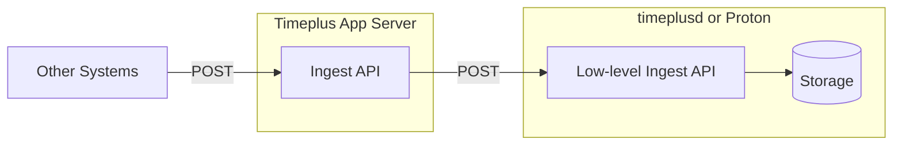

import Tabs from '@theme/Tabs';
import TabItem from '@theme/TabItem';

# Push data to Timeplus via ingest REST API

As a generic solution, you can call the ingestion REST API to push data to Timeplus, with any preferred languages. In many cases, you can configure other systems or tools to push data directly to Timeplus via the ingest REST as the webhook endpoint, without writing code.

This feature is available in Timeplus Enterprise. It leverages the [low-level ingest REST API](/proton-ingest-api) in timeplusd or Timeplus Proton.



Please check https://docs.timeplus.com/rest for the detailed API documentations.

## Create a stream in Timeplus

First you need to create a stream in Timeplus, either using the web UI or via REST API. Columns with proper names and types should be set. In the following section, we assume the stream name is `foo`.

## Set Authorization Header

For Timeplus Enterprise self-hosted deployments, you need to set HTTP Authorization header to be `Basic [Base64 encoded user:password]`. For example, if the user name is `hello` and the password is `world`. The base64-encoded content for `hello:world` is `aGVsbG86d29scmQ=`. Then you need to set the HTTP header as `Authorization: Basic aGVsbG86d29scmQ=`.

A new user will be created when you login Timeplus Enterprise for the first time. You can also add new users via web console or [CLI](/cli-user#create).

## Push data to Timeplus

### Endpoint

The endpoint for real-time data ingestion is `https://host/{workspace-id}/api/v1beta2/streams/{name}/ingest`. Please note:

1. If you self-host Timeplus Enterprise, depending on whether you enable HTTPS, choose `http` or `https` accordingly. The workspace ID is `default`.
2. You need to send `POST` request to this endpoint.

### Options

Depending on your use cases, there are many options to push data to Timeplus via REST API. You can set different `Content-Type` in the HTTP Header, and add the `format` query parameter in the URL.

Here are a list of different use cases to push data to Timeplus:

| Use Cases                                                                     | Sample POST body                                                                                                         | Content-Type           | URL                                  | Columns in the target stream      |
| ----------------------------------------------------------------------------- | ------------------------------------------------------------------------------------------------------------------------ | ---------------------- | ------------------------------------ | --------------------------------- |
| 1) Push JSON objects. Each JSON is an event.                                  | \{"key1": "value11", "key2": "value12", ...}<br/>\{"key1": "value21", "key2": "value22", ...}                              | `application/x-ndjson` | ingest?format=streaming              | multiple columns, e.g. key1, key2 |
| 2) Push a single JSON or a long text. Single event.                           | \{"key1": "value11", "key2": "value12", ...}                                                                              | `text/plain`           | ingest?format=raw                    | single column, named `raw`        |
| 3) Push a batch of events. Each line is an event.                             | event1<br/>event2                                                                                                        | `text/plain`           | ingest?format=lines                  | single column, named `raw`        |
| 4) Push a special JSON with multiple events, without repeating the column name | \{ <br/> "columns": ["key1","key2"],<br/> "data": [ <br/> ["value11","value12"],<br/> ["value21","value22"],<br/> ]<br/>} | `application/json`     | ingest?format=compact or just ingest | multiple columns, e.g. key1, key2 |

#### 1) Push JSON objects directly {#option1}

Request samples
<Tabs defaultValue="curl">
<TabItem value="js" label="Node.js" default>

```js
const https = require("https");
const options = {
  hostname: "host",
  path: "/ws123456/api/v1beta2/streams/foo/ingest?format=streaming",
  method: "POST",
  headers: {
    "Content-Type": "application/x-ndjson",
    "X-Api-Key": "<your_api_key>",
  },
};

const data = `
{"key1": "value11", "key2": "value12"}
{"key1": "value21", "key2": "value22"}
`;
const request = https.request(options, (resp) => {});
request.on("error", (error) => {
  console.error(error);
});
request.write(data);
request.end();
```

  </TabItem>
  <TabItem value="curl" label="curl">

```bash
curl -s -X POST -H "X-Api-Key: your_api_key" \
-H "Content-Type: application/x-ndjson" \
https://host/ws123456/api/v1beta2/streams/foo/ingest?format=streaming \
-d '
{"key1": "value11", "key2": "value12"}
{"key1": "value21", "key2": "value22"}
'
```

  </TabItem>
  <TabItem value="py" label="Python">

```python
import requests

url = "https://host/ws123456/api/v1beta2/streams/foo/ingest?format=streaming"
headers = {
    "X-Api-Key": "your_api_key",
    "Content-Type": "application/x-ndjson"
}
data = '''
{"key1": "value11", "key2": "value12"}
{"key1": "value21", "key2": "value22"}
'''

response = requests.post(url, headers=headers, data=data)
print(response.status_code)
print(response.text)
```

  </TabItem>
  <TabItem value="java" label="Java">

```java
import okhttp3.MediaType;
import okhttp3.OkHttpClient;
import okhttp3.Request;
import okhttp3.RequestBody;
import okhttp3.Response;

import java.io.IOException;

public class Example {
    public static void main(String[] args) throws IOException {
        OkHttpClient client = new OkHttpClient();

        String url = "https://host/ws123456/api/v1beta2/streams/foo/ingest?format=streaming";
        MediaType mediaType = MediaType.parse("application/x-ndjson");
        String data = """
          {"key1": "value11", "key2": "value12"}
          {"key1": "value21", "key2": "value22"}
          """;
        RequestBody body = RequestBody.create(mediaType, data);

        Request request = new Request.Builder()
                .url(url)
                .header("X-Api-Key", "your_api_key")
                .header("Content-Type", "application/x-ndjson")
                .post(body)
                .build();

        try (Response response = client.newCall(request).execute()) {
            System.out.println(response.code());
            System.out.println(response.body().string());
        }
    }
}
```

  </TabItem>
</Tabs>

You can push Newline Delimited JSON (https://github.com/ndjson/ndjson-spec/) to the endpoint. Make sure you set the HTTP Header as one of these:

- `application/x-ndjson`
- `application/vnd.timeplus+json;format=streaming`

:::info

If you would like to leverage a 3rd party system/tool to push data to Timeplus but it doesn't allow custom content type, then you can use the standard `application/json`, and send POST request to `/api/v1beta2/streams/$STREAM_NAME/ingest?format=streaming`. This will ensure the Timeplus API server treats the POST data as NDJSON.

:::

The request body is just a stream of JSON objects. e.g.

```json
{"key1": "value11", "key2": "value12", ...}
{"key1": "value21", "key2": "value22", ...}
...
```

Each object does not have to be in a single line. For example:

```json
{
  "key1": "value11",
  "key2": "value12", ...
}
{
  "key1": "value21",
  "key2": "value22", ...
}
...
```

They don’t have to be separated by newline either:

```json
{"key1": "valueA", ...}{"key1": "valueB", ...}{"key1": "valueC", ...,
}...
```

Just make sure all columns in the target stream are specified with proper value in the request body.

#### 2) Push a single JSON or string to a single column stream {#option2}

Request samples
<Tabs defaultValue="curl">
<TabItem value="js" label="Node.js" default>

```js
const https = require("https");
const options = {
  hostname: "host",
  path: "/ws123456/api/v1beta2/streams/foo/ingest?format=raw",
  method: "POST",
  headers: {
    "Content-Type": "text/plain",
    "X-Api-Key": "<your_api_key>",
  },
};

const data = `{"key1": "value11", "key2": "value12"}`;
const request = https.request(options, (resp) => {});
request.on("error", (error) => {
  console.error(error);
});
request.write(data);
request.end();
```

  </TabItem>
  <TabItem value="curl" label="curl">

```bash
curl -s -X POST -H "X-Api-Key: your_api_key" \
-H "Content-Type: text/plain" \
https://host/ws123456/api/v1beta2/streams/foo/ingest?format=raw \
-d '
{"key1": "value11", "key2": "value12"}
'
```

  </TabItem>
  <TabItem value="py" label="Python">

```python
import requests

url = "https://host/ws123456/api/v1beta2/streams/foo/ingest?format=raw"
headers = {
    "X-Api-Key": "your_api_key",
    "Content-Type": "text/plain"
}
data = '''
{"key1": "value11", "key2": "value12"}
'''

response = requests.post(url, headers=headers, data=data)
print(response.status_code)
print(response.text)
```

  </TabItem>
  <TabItem value="java" label="Java">

```java
import okhttp3.MediaType;
import okhttp3.OkHttpClient;
import okhttp3.Request;
import okhttp3.RequestBody;
import okhttp3.Response;

import java.io.IOException;

public class Example {
    public static void main(String[] args) throws IOException {
        OkHttpClient client = new OkHttpClient();

        String url = "https://host/ws123456/api/v1beta2/streams/foo/ingest?format=raw";
        MediaType mediaType = MediaType.parse("text/plain");
        String data = """
          {"key1": "value11", "key2": "value12"}
          """;
        RequestBody body = RequestBody.create(mediaType, data);

        Request request = new Request.Builder()
                .url(url)
                .header("X-Api-Key", "your_api_key")
                .header("Content-Type", "text/plain")
                .post(body)
                .build();

        try (Response response = client.newCall(request).execute()) {
            System.out.println(response.code());
            System.out.println(response.body().string());
        }
    }
}
```

  </TabItem>
</Tabs>

It's a common practice to create a stream in Timeplus with a single `string` column, called `raw`. You can put JSON objects in this column then extract values (such as `select raw:key1`), or put the raw log message in this column.

When you set Content-Type header to `text/plain`, and add `format=raw` to the ingestion endpoint, the entire body in the POST request will be put in the `raw` column.

#### 3) Push multiple JSON or text to a single column stream. Each line is an event {#option3}
Request samples
<Tabs defaultValue="curl">
<TabItem value="js" label="Node.js" default>

```js
const https = require("https");
const options = {
  hostname: "host",
  path: "/ws123456/api/v1beta2/streams/foo/ingest?format=lines",
  method: "POST",
  headers: {
    "Content-Type": "text/plain",
    "X-Api-Key": "<your_api_key>",
  },
};

const data = `{"key1": "value11", "key2": "value12"}
{"key1": "value21", "key2": "value22"}
`;
const request = https.request(options, (resp) => {});
request.on("error", (error) => {
  console.error(error);
});
request.write(data);
request.end();
```

  </TabItem>
  <TabItem value="curl" label="curl">

```bash
curl -s -X POST -H "X-Api-Key: your_api_key" \
-H "Content-Type: text/plain" \
https://host/ws123456/api/v1beta2/streams/foo/ingest?format=lines \
-d '{"key1": "value11", "key2": "value12"}
{"key1": "value21", "key2": "value22"}
'
```

  </TabItem>
  <TabItem value="py" label="Python">

```python
import requests

url = "https://host/ws123456/api/v1beta2/streams/foo/ingest?format=lines"
headers = {
    "X-Api-Key": "your_api_key",
    "Content-Type": "text/plain"
}
data = '''{"key1": "value11", "key2": "value12"}
{"key1": "value21", "key2": "value22"}
'''

response = requests.post(url, headers=headers, data=data)
print(response.status_code)
print(response.text)
```

  </TabItem>
  <TabItem value="java" label="Java">

```java
import okhttp3.MediaType;
import okhttp3.OkHttpClient;
import okhttp3.Request;
import okhttp3.RequestBody;
import okhttp3.Response;

import java.io.IOException;

public class Example {
    public static void main(String[] args) throws IOException {
        OkHttpClient client = new OkHttpClient();

        String url = "https://host/ws123456/api/v1beta2/streams/foo/ingest?format=lines";
        MediaType mediaType = MediaType.parse("text/plain");
        String data = """
          {"key1": "value11", "key2": "value12"}
          {"key1": "value21", "key2": "value22"}
""";
        RequestBody body = RequestBody.create(mediaType, data);

        Request request = new Request.Builder()
                .url(url)
                .header("X-Api-Key", "your_api_key")
                .header("Content-Type", "text/plain")
                .post(body)
                .build();

        try (Response response = client.newCall(request).execute()) {
            System.out.println(response.code());
            System.out.println(response.body().string());
        }
    }
}
```

  </TabItem>
</Tabs>

When you set Content-Type header to `text/plain`, and add `format=lines` to the ingestion endpoint, each line in the POST body will be put in the `raw` column.

#### 4) Push multiple events in a batch without repeating the columns {#option4}
Request samples
<Tabs defaultValue="curl">
<TabItem value="js" label="Node.js" default>

```js
const https = require("https");
const options = {
  hostname: "host",
  path: "/ws123456/api/v1beta2/streams/foo/ingest",
  method: "POST",
  headers: {
    "Content-Type": "application/json",
    "X-Api-Key": "<your_api_key>",
  },
};

const data = `
{
  "columns": ["key1","key2"],
  "data": [
    ["value11","value12"],
    ["value21","value22"],
  ]
}
`;
const request = https.request(options, (resp) => {});
request.on("error", (error) => {
  console.error(error);
});
request.write(data);
request.end();
```

  </TabItem>
  <TabItem value="curl" label="curl">

```bash
curl -s -X POST -H "X-Api-Key: your_api_key" \
-H "Content-Type: application/json" \
https://host/ws123456/api/v1beta2/streams/foo/ingest \
-d '
{
  "columns": ["key1","key2"],
  "data": [
    ["value11","value12"],
    ["value21","value22"],
  ]
}
'
```

  </TabItem>
  <TabItem value="py" label="Python">

```python
import requests

url = "https://host/ws123456/api/v1beta2/streams/foo/ingest"
headers = {
    "X-Api-Key": "your_api_key",
    "Content-Type": "application/json"
}
data = '''
{
  "columns": ["key1","key2"],
  "data": [
    ["value11","value12"],
    ["value21","value22"],
  ]
}
'''

response = requests.post(url, headers=headers, data=data)
print(response.status_code)
print(response.text)
```

  </TabItem>
  <TabItem value="java" label="Java">

```java
import okhttp3.MediaType;
import okhttp3.OkHttpClient;
import okhttp3.Request;
import okhttp3.RequestBody;
import okhttp3.Response;

import java.io.IOException;

public class Example {
    public static void main(String[] args) throws IOException {
        OkHttpClient client = new OkHttpClient();

        String url = "https://host/ws123456/api/v1beta2/streams/foo/ingest";
        MediaType mediaType = MediaType.parse("text/plain");
        String data = """
{
  "columns": ["key1","key2"],
  "data": [
    ["value11","value12"],
    ["value21","value22"],
  ]
}
          """;
        RequestBody body = RequestBody.create(mediaType, data);

        Request request = new Request.Builder()
                .url(url)
                .header("X-Api-Key", "your_api_key")
                .header("Content-Type", "application/json")
                .post(body)
                .build();

        try (Response response = client.newCall(request).execute()) {
            System.out.println(response.code());
            System.out.println(response.body().string());
        }
    }
}
```

  </TabItem>
</Tabs>
The above method should work very well for most system integration. However, the column names will be repeatedly mentioned in the requested body.

We also provide a more performant solution to only list the column names once.

Same endpoint URL: `https://host/{workspace-id}/api/v1beta2/streams/{name}/ingest`

But you need to set the HTTP Header to one of these:

- `application/json`
- `application/vnd.timeplus+json`
- `application/vnd.timeplus+json;format=compact`

The request body is this format:

```json
{
  "columns": [..],
  "data": [
    [..],
    [..],
  ]
}
```

Note:

- the `columns` is an array of string, with the column names
- the `data` is an array of arrays. Each nested array represents a row of data. The value order must match the exact same order in the `columns`.

For example:

```json
{
  "columns": ["key1", "key2"],
  "data": [
    ["value11", "value12"],
    ["value21", "value22"]
  ]
}
```

You can also use one of our SDKs to ingest data without handling the low level details of REST API.
