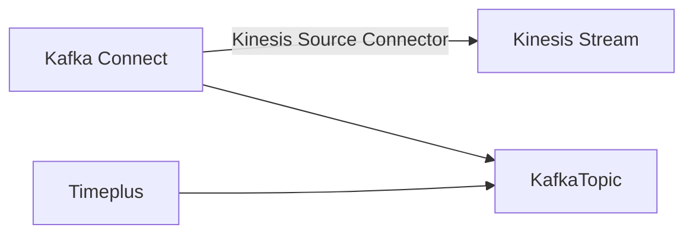

# Data Ingestion

Timeplus supports a wide range of data sources.

## Add new sources via web console

### Load streaming data from Apache Kafka {#kafka}

As of today, Kafka is the primary data source (and sink) for Timeplus. With our strong partnership with Confluent, you can load your real-time data from Confluent Cloud, Confluent Platform, or Apache Kafka into the Timeplus streaming engine. You can also create [external streams](working-with-streams#external_stream) to analyze data in Confluent/Kafka/Redpanda without moving data.

[Learn more.](kafka-source)

### Load streaming data from Apache Pulsar {#pulsar}

Apache® Pulsar™ is a cloud-native, distributed, open source messaging and streaming platform for real-time workloads. Recently Timeplus adds the first-class integration for Apache Pulsar as both a data source and a data sink.

[Learn more.](pulsar-source)

### Load streaming data from Kinesis {#kinesis}

If your streaming data reside in [Amazon Kinesis Data Stream](https://aws.amazon.com/kinesis/data-streams/), you can load them into Timeplus in two steps.

1.  First load the Kinesis data into Kafka topics via [Amazon Kinesis Source Connector for Confluent Cloud](https://docs.confluent.io/cloud/current/connectors/cc-kinesis-source.html) or [Amazon Kinesis Source Connector for Confluent Platform](https://docs.confluent.io/kafka-connect-kinesis/current/overview.html)
2. Use the above Kafka source in Timeplus to load data into streams.

The data flow can be illustrated as the following:

### Upload local files

If you have some static dataset or lookup tables in the CSV format, you can upload the files directly to Timeplus.

1. Click the **Add Data** from the navigation menu. Then click **Files** and click the **Start** button
2. Drag and drop a CSV file from your local file system to upload the file. Or you can specify a URL for Timeplus to download the file. Currently we only support CSV format. Other formats will be supported shortly.
3. Specify a name for this data source, and optionally provide a readable description.
4. Similar to the Kafka source, you can choose to create a new stream or select an existing stream. Usually the CSV file contains the column header in the first row. Deselect that option if no header is available, then Timeplus will create column names.
5. Click **Next** to preview the streaming data and choose a column as the event time. 
6. Finish the rest of the wizard and your streaming data will be available in the new stream immediately. 

### Load sample streaming data

If you are not ready to load your real data into Timeplus, or just want to play with the system, you can use this feature to load some sampling streaming data. We provide 3 typical steaming data

1. `iot_data` will generate data for 3 devices(device_0, device_1 and device_2). The `number` value can be anything between 0 to 100. The `time` column is the when the event is generated.
2. `user_logins` will generate data for 2 users(user1 and user2), from 2 possible `city` value: Shanghai or Beijing. The `time` column is the when the event is generated.
3. `devops` will generate data for 3 `hostname`(host_0,host_1, and host_2), from 3 possible `region`(eu-central-1, us-west-1, and sa-east-1), 3 possible `rack`(1,2,3), a number `usage_user` from 0 to 100, `usage_system` from 0 to 100, and `time` column for the event time.

You can load such sample datas via the **Add Data** menu and the **Sample Data** option. You can create new streams or choose existing streams for the data.

[Learn more.](stream-generator)

## Push data to Timeplus via REST or SDK {#push}

Timeplus provides ingestion REST API, and related SDKs in different programming languages. Developers can leverage those REST API or SDK to push real-time data to Timeplus.

[Learn more.](ingest-api)

## Load other data into Timeplus via 3rd party tools

Timeplus works with the data ecosystems and can leverage various tools to load data or even do data transformation at ingestion time.

### DataPM (for files and databases) {#datapm}
Data Package Manager (datapm) is an [open source](https://github.com/big-armor/datapm) data publishing platform for private and public use. The datapm command line tool makes moving data between systems seamless and easily repeatable. A special sink for Timeplus is shipped with the datapm command line tool out-of-box. 

[Learn more.](datapm)

### Airbyte

AirByte provides both OSS version and managed cloud to collect data, transform data and send to other destinations. 

At the high level

1. AirByte can grab data from many different data sources, including database/CDC, or infrastructure log, application logs, or even business apps(such as Salesforce)
2. The data can be normalized via AirByte built-in capabilities. Or it can be saved to the destination database first, then relies on dbt or other tools to apply transformations/materialization. 
3. Data collected by AirByte can be send to many destinations, including Timeplus.

Just name a few data sources from Airbyte:

* App market place such as Apple App Store
* AWS Cloudtrail
* Google BigQuery
* Load file from S3/GCS/SFTP/local with Gzip/Zip/xz/Snappy compression, in CSV/JSON/XML/Excel/Parquet/etc
* Github, GitLab, or JIRA activities
* Google Ads
* Instagram social media
* Slack or Microsoft Teams
* PostgreSQL, RedShift, Snowflake, MongoDB, MySQL, Microsoft SQL Server, etc

:::info

The Timeplus destination plugin for Airbyte is in the early stage. Please contact us to arrange the integration. 

:::

### Kafka Connectors

You can use Kafka Connectors to load data from popular data sources into Confluent Cloud, Confluent Platform, or Apache Kafka, then use Timeplus load them into streams via the built-in Kafka Source.

There are a few examples of data sources that can be ingested into Timeplus via Kafka Connectors. Please check https://www.confluent.io/product/confluent-connectors/ for more details.

* Apache ActiveMQ
* Amazon CloudWatch Logs
* [Amazon Kinesis](#kinesis)
* Amazon S3 
* Amazon SQS
* Azure Blob Storage
* Azure Event Hubs
* CockroachDB CDC
* Databricks
* Github
* Google Cloud Pub/Sub
* IBM MQ
* InfluxDB
* JDBC
* Microsoft SQL Server
* MongoDB
* MQTT
* MySQL CDC
* Neo4j
* Oracle Database
* PostgreSQL CDC
* RabbitMQ
* Salesforce
* ServiceNow
* SFTP
* SNMP
* Splunk
* TiDB CDC
* Tigergraph
* Zendesk
