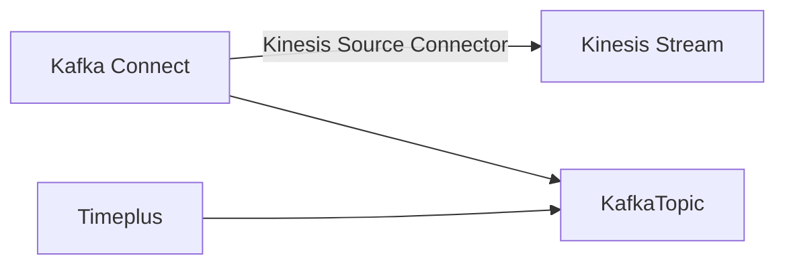

# Data Ingestion

Timeplus supports a wide range of data sources.

## Add new sources via web console

### Load streaming data from Apache Kafka {#kafka}

As of today, Kafka is the primary data source (and sink) for Timeplus. By the strong partnership with Confluent, we can load real-time data from Confluent Cloud, Confluent Platform, or Apache Kafka into Timeplus streaming engine. (A new feature is recently introduced to create [external streams](working-with-streams#external_stream) to analyze data in Confluent/Kafka/Redpanda without moving data)

#### Confluent Cloud

1. Click the **Add Data** from the navigation menu. Then click **Kafka** and click the **Start** button
2. Specify a name for this data source, and optionally provide a readable description.
2. Choose Confluent Cloud for the deployment type of the Kafka.
2. Specify the broker(s) URL, such as `pkc-abc12.us-west-2.aws.confluent.cloud:9092`
4. Specify the name of the Kafka topic. 
4. When you select Confluent Cloud, the **SASL Plain** is automatically selected. Type in the API Key and Secret Key for your cluster.
4. For Data Format, we currently support JSON, AVRO and Text format. If the data in the Kafka topic is in JSON format, but the schema may change over time, we recommend you to choose the Text format, so that the entire JSON document will be saved as a string, and you can apply JSON related functions to extract value, even the schema is changed. 
4. If you choose AVRO, there is an option for 'Auto Extraction'. By default it's turned off, meaning the entire message will be saved as a string. If you turn it on, then the top level attribute in the AVRO message will be put into different columns. This would be more convenient for you to query, but won't support schema evolution.  When AVRO is selected, you also need to specify the address, API key, and secret key for the schema registry. 
5. By default, the source can create a new stream in Timeplus. Please specify the new stream name. Alternatively, you can disable the stream creation and choose an existing stream from the list.
7. Click **Next** to preview the streaming data from the specified Kafka source and choose a column as the event time. 
8. Finish the rest of the wizard and your streaming data will be available in the new stream immediately. 

#### Custom Kafka Deployment

Similar steps as loading data from Confluent Cloud. You may not need to specify the `SASL Plain` as the authentication method. Please make sure Timeplus can reach out to your Kafka broker(s)


#### Notes for Kafka source

Please note:

1. Currently we only support JSON format for the messages in Kafka topics
2. The topic level JSON attributes will be converted to stream columns. For nested attributes, the element will be saved as a `String` column and later you can query them with one of the [JSON functions](functions#processing-json).
3. Values in number or boolean types in the JSON message will be converted to corresponding type in the stream.
4. Datetime or timestamp will be saved as a String column. You can convert them back to DateTime via [toTime function](functions#totime).


### Load streaming data from Apache Pulsar {#pulsar}

Apache® Pulsar™ is a cloud-native, distributed, open source messaging and streaming platform for real-time workloads. Recently Timeplus adds the first-class integration for Apache Pulsar as both a data source and a data sink.

#### Supported Pulsar Version, Deployment and Authentication

Pulsar 2.9.0 or above is supported.

Both Apache Pulsar and StreamNative Cloud are supported.

:::info Note for StreamNative Cloud support

In order to connect to StreamNative Cloud, you will need to setup a service account. 

1. Go to the select "Service Accounts" from the navigation panel on the left side (you need to select an instance on the home page to see the navigation panel).
2. Create a service account, you don't need "Super Admin" permission. Skip if you have one already.
3. Assign read and/or write permissions (depends on if you want to create a source or a sink) of a topic to the service account (or you can have two service accounts, one for read, one for write). This can be done by first, select "Topics", pick one topic (or create a new one) you want to use, click it. And then click the "POLICIES" tab, and add the service account to the topic's "Authorization" list.
4. Go back to the "Service Accounts" page.  Choose either Token or OAuth2.

:::

There are 3 types of supported authentications:

* None. Set the `auth_type`to an empty string while calling the REST API. This usually works with a local Pulsar for test purpose only.
* OAuth2.  Set the `auth_type`to `oauth2` while calling the REST API to create the Pulsar source. It is supported by StreamNative Cloud. The following parameters are expected in the `auth_params` payload:
  * `issuer_url` required
  * `audience` required
  * `private_key` required
  * `client_id` required
  * `scope` this is optional
* Token.  Set the `auth_type`to `token` while calling the REST API to create the Pulsar source.  Also need to set `token` key/value in the  `auth_params` payload. It is also supported by StreamNative Cloud.

#### Source configuration 

| name                          | type     | required? | default | description                                                  |
| ----------------------------- | -------- | --------- | ------- | ------------------------------------------------------------ |
| broker_url                    | string   | Y         |         | The URL of the Pulsar broker, e.g. `pulsar://localhost:6650` for insecure connection, `pulsar+ssl://localhost:6651` for secure connection. |
| topic                         | string   | Y         |         | The topic name, e.g. `persistent://ns/tenant/topic` for persistent topic, `non-perisistent://ns/tenant/topic` for non-persistent topic. |
| connection_timeout            | duration | N         | `"5s"`  | Timeout for the establishment of a TCP connection.           |
| tls_allow_insecure_connection | bool     | N         | `false` | Configure whether the Pulsar client accept untrusted TLS certificate from broker. |
| tls_validate_hostname         | bool     | N         | `false` | Configure whether the Pulsar client verify the validity of the host name from broker. |
|start_position|string|N|`"latest"`|Configure the source to read from the `"earliest"` message from the topic or the `"latest"`.|
|message_decoder|string|N|`"text"`|Configure how the source should decode messages, either `"text"` or `"json"`.|
|ReceiverQueueSize|int|N|`1000`|Sets the size of the consumer receive queue. Using a higher value could potentially increase the consumer throughput at the expense of bigger memory utilization.|

### Load streaming data from Kinesis {#kinesis}

If your streaming data reside in [Amazon Kinesis Data Stream](https://aws.amazon.com/kinesis/data-streams/), you can load them into Timeplus in two steps.

1.  First load the Kinesis data into Kafka topics via [Amazon Kinesis Source Connector for Confluent Cloud](https://docs.confluent.io/cloud/current/connectors/cc-kinesis-source.html) or [Amazon Kinesis Source Connector for Confluent Platform](https://docs.confluent.io/kafka-connect-kinesis/current/overview.html)
2. Use the above Kafka source in Timeplus to load data into streams.

The data flow can be illustrated as the following:




### Upload local files

If you have some static dataset or lookup tables in the CSV format, you can upload the files directly to Timeplus.

1. Click the **Add Data** from the navigation menu. Then click **Files** and click the **Start** button
2. Drag and drop a CSV file from your local file system to upload the file. Or you can specify a URL for Timeplus to download the file. Currently we only support CSV format. Other formats will be supported shortly.
3. Specify a name for this data source, and optionally provide a readable description.
4. Similar to the Kafka source, you can choose to create a new stream or select an existing stream. Usually the CSV file contains the column header in the first row. Deselect that option if no header is available, then Timeplus will create column names.
5. Click **Next** to preview the streaming data and choose a column as the event time. 
6. Finish the rest of the wizard and your streaming data will be available in the new stream immediately. 


### Load sample streaming data

If you are not ready to load your real data into Timeplus, or just want to play with the system, you can use this feature to load some sampling streaming data. We provide 3 typical steaming data

1. `iot_data` will generate data for 3 devices(device_0, device_1 and device_2). The `number` value can be anything between 0 to 100. The `time` column is the when the event is generated.
2. `user_logins` will generate data for 2 users(user1 and user2), from 2 possible `city` value: Shanghai or Beijing. The `time` column is the when the event is generated.
3. `devops` will generate data for 3 `hostname`(host_0,host_1, and host_2), from 3 possible `region`(eu-central-1, us-west-1, and sa-east-1), 3 possible `rack`(1,2,3), a number `usage_user` from 0 to 100, `usage_system` from 0 to 100, and `time` column for the event time.

You can load such sample datas via the **Add Data** menu and the **Sample Data** option. You can create new streams or choose existing streams for the data.


## Load other data into Timeplus via 3rd party tools

Timeplus works with the data ecosystems and can leverage various tools to load data or even do data transformation at ingestion time.


### Airbyte

AirByte provides both OSS version and managed cloud to collect data, transform data and send to other destinations. 

At the high level

1. AirByte can grab data from many different data sources, including database/CDC, or infrastructure log, application logs, or even business apps(such as Salesforce)
2. The data can be normalized via AirByte built-in capabilities. Or it can be saved to the destination database first, then relies on dbt or other tools to apply transformations/materialization. 
3. Data collected by AirByte can be send to many destinations, including Timeplus.

Just name a few data sources from Airbyte:

* App market place such as Apple App Store
* AWS Cloudtrail
* Google BigQuery
* Load file from S3/GCS/SFTP/local with Gzip/Zip/xz/Snappy compression, in CSV/JSON/XML/Excel/Parquet/etc
* Github, GitLab, or JIRA activities
* Google Ads
* Instagram social media
* Slack or Microsoft Teams
* PostgreSQL, RedShift, Snowflake, MongoDB, MySQL, Microsoft SQL Server, etc


:::info

The Timeplus destination plugin for Airbyte is in the early stage. Please contact us to arrange the integration. 

:::

### Kafka Connectors

You can use Kafka Connectors to load data from popular data sources into Confluent Cloud, Confluent Platform, or Apache Kafka, then use Timeplus load them into streams via the built-in Kafka Source.

There are a few examples of data sources that can be ingested into Timeplus via Kafka Connectors. Please check https://www.confluent.io/product/confluent-connectors/ for more details.

* Apache ActiveMQ
* Amazon CloudWatch Logs
* [Amazon Kinesis](#kinesis)
* Amazon S3 
* Amazon SQS
* Azure Blob Storage
* Azure Event Hubs
* CockroachDB CDC
* Databricks
* Github
* Google Cloud Pub/Sub
* IBM MQ
* InfluxDB
* JDBC
* Microsoft SQL Server
* MongoDB
* MQTT
* MySQL CDC
* Neo4j
* Oracle Database
* PostgreSQL CDC
* RabbitMQ
* Salesforce
* ServiceNow
* SFTP
* SNMP
* Splunk
* TiDB CDC
* Tigergraph
* Zendesk

### Insert data directly via SQL

Timeplus also provides database drivers, so that you can also connect to Timeplus via your favorite SQL clients and run SQL to insert data.

:::info

The Timeplus database driver is in the early stage. Please contact us to arrange the integration. 

:::

```sql
INSERT INTO <stream_name> (<col_name_1>, <col_name_2>, ...)
VALUES
(<col_value_1>, <col_value_2>, ...), (<col_value_11>, <col_value_22, ...), ...
```

When appending data to target stream, users can specify all column names in any order or some column names of the stream to insert data.
If only some of the column names of the target stream are specified, Proton will use default values for unspecified ones.

Examples:

```sql
INSERT INTO test(i, s) VALUES (1, 'hello'), (2, 'world'), (3, 'more');
```

