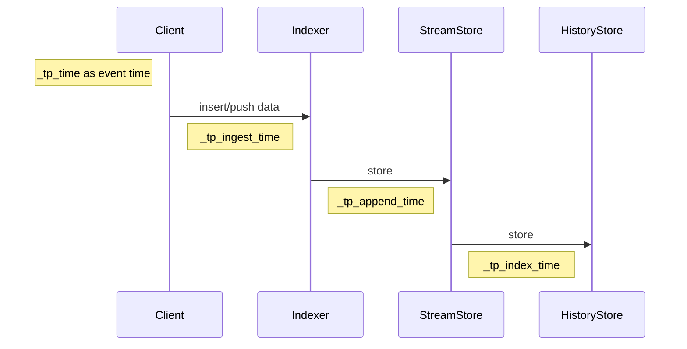
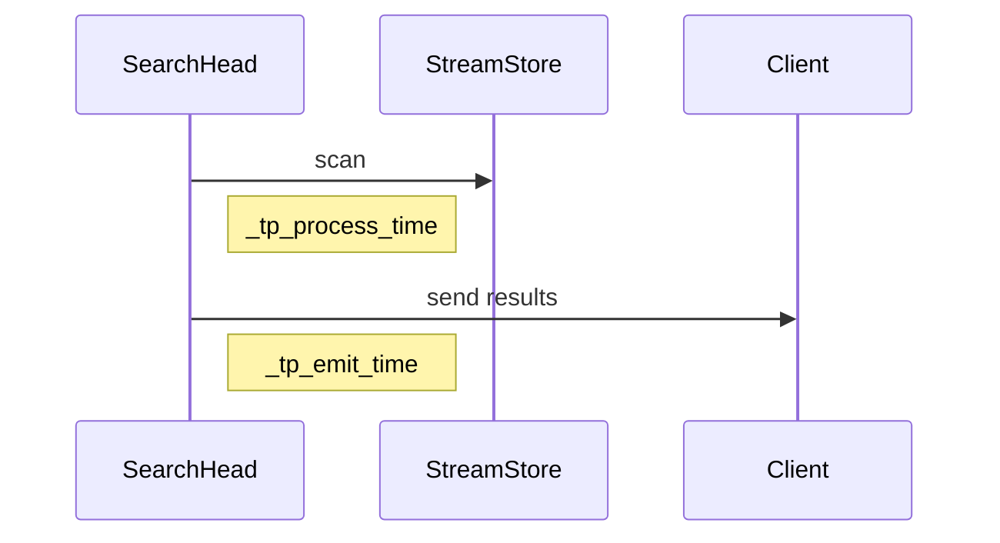
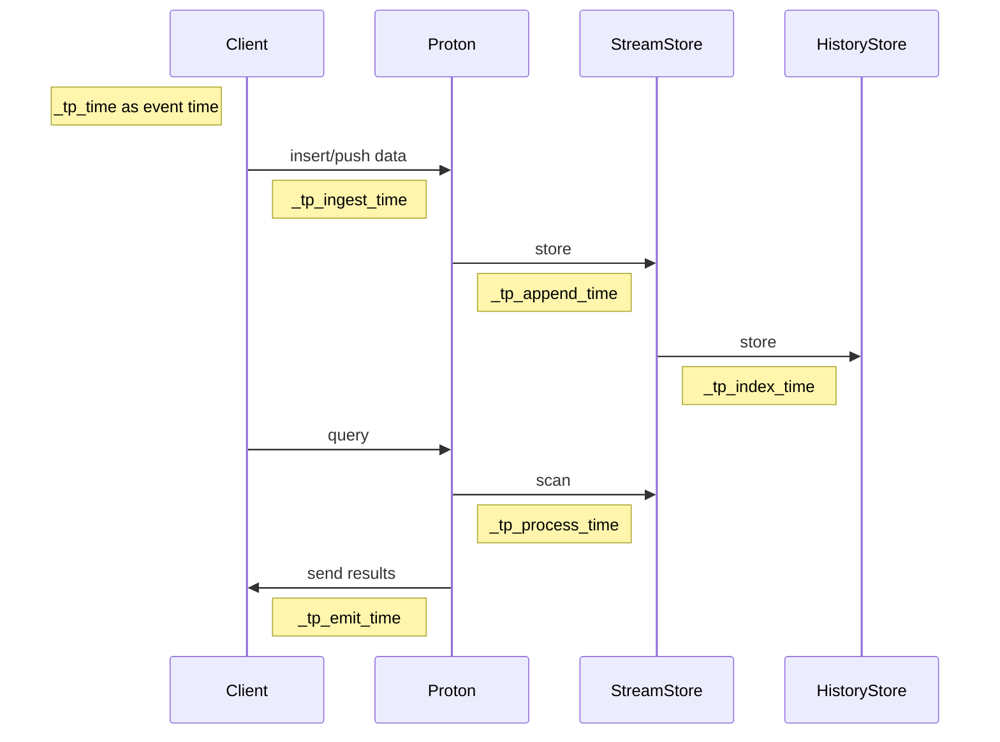

# Timestamps in Proton

This is an internal doc
##  Ingestion Time

```mermaid
sequenceDiagram
Note left of Client: _tp_time as event time 
Client ->> Indexer:insert/push data
Note left of Indexer: _tp_ingest_time
Indexer ->> StreamStore:store
Note left of StreamStore: _tp_append_time
StreamStore ->> HistoryStore:store
Note left of HistoryStore: _tp_index_time
```

## Query Time

```mermaid
sequenceDiagram
SearchHead ->> StreamStore:scan
Note left of StreamStore: _tp_process_time
SearchHead ->> Client:send results
Note right of SearchHead: _tp_emit_time
```

## Combined
If we combine the `Indexer` and `SearchHead` as the vague `Proton`, then we get this

```mermaid
sequenceDiagram
Note left of Client: _tp_time as event time 
Client ->> Proton:insert/push data
Note left of Proton: _tp_ingest_time
Proton ->> StreamStore:store
Note left of StreamStore: _tp_append_time
StreamStore ->> HistoryStore:store
Note left of HistoryStore: _tp_index_time

Client ->> Proton:query
Proton ->> StreamStore:scan
Note left of StreamStore: _tp_process_time
Proton ->> Client:send results
Note right of Client: _tp_emit_time
```