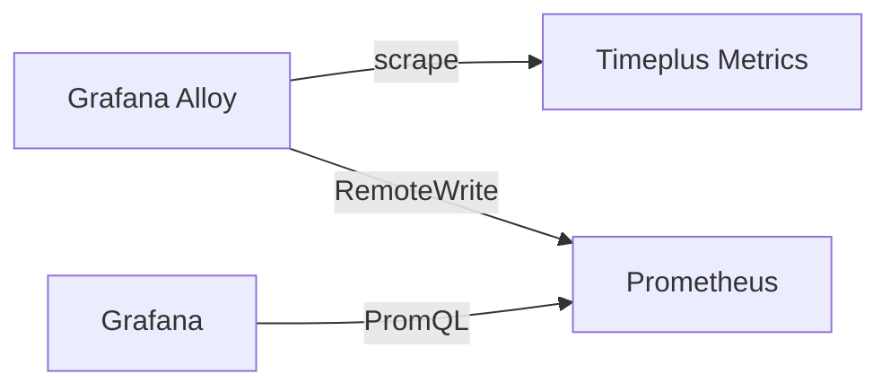

# Prometheus Integration

Timeplus Enterprise exposes a number of metrics that can be scraped by Prometheus. These metrics can be integrated with dashboards and alerting systems like Grafana or Datadog.

## Prometheus Endpoints

By default, Timeplus Enterprise exposes timeplusd metrics on port 9363, and timeplus-connector metrics on port 4196.
|Component|Port|Endpoint|Examples|
|--|---|---|---|
|timeplusd|9363|http://timeplusd_address:9363/metrics|<ul><li>Kubernetes: `http://timeplusd-0.timeplusd-svc.my_ns.svc.cluster.local:9363/metrics`</li><li>Bare metal: `http://localhost:9363/metrics`</li></ul>|
|timeplus-connector|4196|http://connector_address:4196/metrics|<ul><li>Kubernetes: `http://timeplus-connector.my_ns:4196/metrics`</li><li>Bare metal: `http://localhost:4196/metrics`</li></ul>|

## Explore Metrics with Grafana

Grafana is a popular tool for visualizing metrics. Here is a simplified guide to visualize Timeplus Enterprise metrics with Grafana.



### Step 1: Install Grafana, Prometheus and Alloy {#step1}
```bash
brew install grafana prometheus
brew install grafana/grafana/alloy
```

### Step 2: Configure Prometheus {#step2}
Make sure the Prometheus accept remote write. Edit `/opt/homebrew/etc/prometheus.args` and add `--web.enable-remote-write-receiver`.

```
--config.file /opt/homebrew/etc/prometheus.yml
--web.listen-address=127.0.0.1:9090
--web.enable-remote-write-receiver
--storage.tsdb.path /opt/homebrew/var/prometheus
```

Start Prometheus via `brew services start prometheus`.

### Step 3: Configure Grafana Alloy {#step3}
Grafana Alloy is the successor of Grafana Agent. It is a vendor-neutral distribution of the OpenTelemetry (OTel) Collector. Edit `/opt/homebrew/etc/alloy/config.alloy` and add the following:

```json
prometheus.remote_write "default" {
  endpoint {
    url = "http://localhost:9090/api/v1/write"
  }
}
prometheus.scrape "timeplusd" {
  targets = [{
    __address__ = "127.0.0.1:9363",
  }]

  forward_to = [prometheus.remote_write.default.receiver]
}
```

Alloy will read the metrics from timeplusd and forward them to Prometheus. Start Alloy via `brew services start alloy`.

### Step 4: Configure Grafana {#step4}
Start Grafana via `brew services start grafana`. Open `http://localhost:3000` in your browser. The default username and password are `admin` and `admin`. Add a new Data source with the type of Prometheus and the URL of `http://localhost:9090`.

Explore the metrics via http://localhost:3000/explore/metrics.


Contact us if you need help to build Grafana dashboards or alerts with Timeplus Enterprise metrics.
