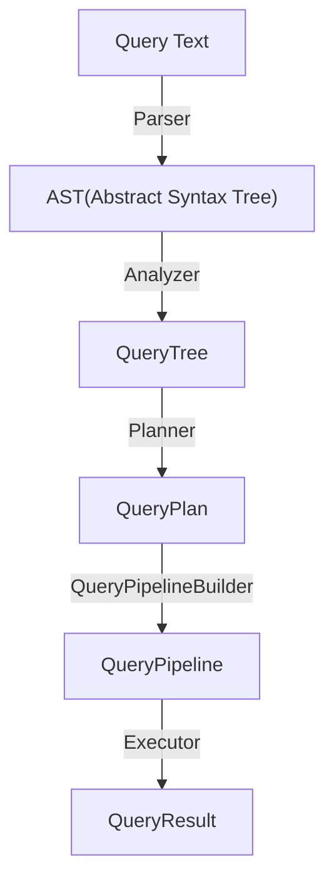

# EXPLAIN

The execution of a query in Timeplus is decomposed into many steps. Each step of the query execution can be analyzed and troubleshooted using the corresponding `EXPLAIN` query. These steps are summarized in the chart below:



## Syntax
```sql
EXPLAIN [AST | SYNTAX | PLAN | PIPELINE | ESTIMATE] [setting = value, ...] <a SQL statement>
```

## EXPLAIN Types {#explain-types}

- `AST` — Abstract syntax tree.
- `SYNTAX` — Query text after AST-level optimizations.
- `PLAN` — Query execution plan. This is the default explain type.
- `PIPELINE` — Query execution pipeline.
- `ESTIMATE` — Query estimated number of rows, marks and parts.

### EXPLAIN AST {#explain-ast}

Dump query AST. Supports all types of queries, not only `SELECT`.

Examples:

```sql
EXPLAIN AST SELECT 1;
```

```
┌─explain───────────────────────────┐
│ SelectWithUnionQuery (children 1) │
│  ExpressionList (children 1)      │
│   SelectQuery (children 1)        │
│    ExpressionList (children 1)    │
│     Literal uint64_1              │
└───────────────────────────────────┘
```

```sql
EXPLAIN AST ALTER STREAM t1 ADD COLUMN new_col string;
```

```
┌─explain───────────────────────────────────┐
│ AlterQuery  t1 (children 2)               │
│  ExpressionList (children 1)              │
│   AlterCommand ADD_COLUMN (children 1)    │
│    ColumnDeclaration new_col (children 1) │
│     DataType string                       │
│  Identifier t1                            │
└───────────────────────────────────────────┘
```

### EXPLAIN SYNTAX {#explain-syntax}

Shows the Abstract Syntax Tree (AST) of a query after syntax analysis.

It's done by parsing the query, constructing query AST and query tree, optionally running query analyzer and optimization passes, and then converting the query tree back to the query AST. Settings are not supported for `EXPLAIN SYNTAX` query.

Example:

```sql
EXPLAIN SYNTAX SELECT * FROM system.numbers AS a, system.numbers AS b, system.numbers AS c WHERE a.number = b.number AND b.number = c.number;
```

Output:

```sql
┌─explain──────────────────────────────────────────────────────────────────────────────┐
│ SELECT                                                                               │
│   a.`--a.number` AS `a.number`, b.`--b.number` AS `b.number`, c.number AS `c.number` │
│ FROM                                                                                 │
│   (                                                                                  │
│     SELECT                                                                           │
│       a.number AS `--a.number`, b.number AS `--b.number`                             │
│     FROM                                                                             │
│       system.numbers AS a                                                            │
│     ALL INNER JOIN system.numbers AS b ON `--a.number` = `--b.number`                │
│     WHERE                                                                            │
│       `--a.number` = `--b.number`                                                    │
│   ) AS `--.s`                                                                        │
│ ALL INNER JOIN system.numbers AS c ON b.`--b.number` = c.number                      │
│ WHERE                                                                                │
│   (a.`--a.number` = b.`--b.number`) AND (b.`--b.number` = c.number)                  │
└──────────────────────────────────────────────────────────────────────────────────────┘
```

### EXPLAIN PLAN {#explain-plan}

Dump query plan steps. This is the default explain type. Running `EXPLAIN` is same as `EXPLAIN PLAN`.

Settings:
- `json` — Prints query plan steps as a row in JSON format. Default: 0. It is recommended to use `TSVRaw` format to avoid unnecessary escaping.
- `description` — Prints step description. Default: 1.
- `header` — Prints output header for step. Default: 0.
- `indexes` — Shows used indexes, the number of filtered parts and the number of filtered granules for every index applied. Default: 0. Supported for streams with columnar storages, i.e. [Append Stream](/append-stream), [Versioned KV Stream](/versioned-stream), and [Changelog KV Stream](/changelog-stream).
- `actions` — Prints detailed information about step actions. Default: 0.

When `json=1` step names will contain an additional suffix with unique step identifier.

Example:

```sql
EXPLAIN SELECT sum(number) FROM numbers(10) GROUP BY number % 4;
```

```
┌─explain─────────────────────────────────────┐
│ Expression ((Projection + Before ORDER BY)) │
│   Aggregating                               │
│     Expression (Before GROUP BY)            │
│       ReadFromSystemNumbers                 │
└─────────────────────────────────────────────┘
```

:::note
Step and query cost estimation is not supported.
:::

#### json
When `json = 1`, the query plan is represented in JSON format. Every node is a dictionary that always has the keys `Node Type` and `Plans`. `Node Type` is a string with a step name. `Plans` is an array with child step descriptions. Other optional keys may be added depending on node type and settings.

Example:

```sql
EXPLAIN json = 1, description = 0 SELECT 1 UNION ALL SELECT 2 FORMAT TSVRaw;
```

```json
[
  {
    "Plan": {
      "Node Type": "Union",
      "Plans": [
        {
          "Node Type": "Expression",
          "Plans": [
            {
              "Node Type": "ReadFromStorage"
            }
          ]
        },
        {
          "Node Type": "Expression",
          "Plans": [
            {
              "Node Type": "ReadFromStorage"
            }
          ]
        }
      ]
    }
  }
]
```
#### description
With `description` = 1, the `Description` key is added to the step:

```json
{
  "Node Type": "ReadFromStorage",
  "Description": "SystemOne"
}
```
#### header
With `header` = 1, the `Header` key is added to the step as an array of columns.

Example:

```sql
EXPLAIN json = 1, description = 0, header = 1 SELECT 1, 2 + dummy FORMAT TSVRaw;
```

```json
[
  {
    "Plan": {
      "Node Type": "Expression",
      "Header": [
        {
          "Name": "1",
          "Type": "uint8"
        },
        {
          "Name": "plus(2, dummy)",
          "Type": "uint16"
        }
      ],
      "Plans": [
        {
          "Node Type": "ReadFromStorage",
          "Header": [
            {
              "Name": "dummy",
              "Type": "uint8"
            }
          ]
        }
      ]
    }
  }
]
```
#### indexes
With `indexes` = 1, the `Indexes` key is added. It contains an array of used indexes. Each index is described as JSON with `Type` key (a string `MinMax`, `Partition`, `PrimaryKey` or `Skip`) and optional keys:

- `Name` — The index name (currently only used for `Skip` indexes).
- `Keys` — The array of columns used by the index.
- `Condition` —  The used condition.
- `Description` — The index description (currently only used for `Skip` indexes).
- `Parts` — The number of parts before/after the index is applied.
- `Granules` — The number of granules before/after the index is applied.

Example:
```sql
CREATE MUTABLE STREAM products
(
    product_id int32,
    category string,
    name string,
    price decimal64(2),
    INDEX idx_category (category) STORING (name),
    INDEX idx_price (price) UNIQUE
) PRIMARY KEY product_id;

EXPLAIN json = 1, description = 1, header = 1, indexes=1 SELECT * FROM products FORMAT TSVRaw;
```

```json
[
  {
    "Plan": {
      "Node Type": "Expression",
      "Description": "(Projection + Before ORDER BY)",
      "Header": [
        {
          "Name": "product_id",
          "Type": "int32"
        },
        {
          "Name": "category",
          "Type": "string"
        },
        {
          "Name": "name",
          "Type": "string"
        },
        {
          "Name": "price",
          "Type": "decimal(18, 2)"
        },
        {
          "Name": "_tp_time",
          "Type": "datetime64(3, 'UTC')"
        }
      ],
      "Plans": [
        {
          "Node Type": "Concat",
          "Header": [
            {
              "Name": "product_id",
              "Type": "int32"
            },
            {
              "Name": "category",
              "Type": "string"
            },
            {
              "Name": "name",
              "Type": "string"
            },
            {
              "Name": "price",
              "Type": "decimal(18, 2)"
            },
            {
              "Name": "_tp_time",
              "Type": "datetime64(3, 'UTC')"
            }
          ],
          "Plans": [
            {
              "Node Type": "Delay",
              "Header": [
                {
                  "Name": "product_id",
                  "Type": "int32"
                },
                {
                  "Name": "category",
                  "Type": "string"
                },
                {
                  "Name": "name",
                  "Type": "string"
                },
                {
                  "Name": "price",
                  "Type": "decimal(18, 2)"
                },
                {
                  "Name": "_tp_time",
                  "Type": "datetime64(3, 'UTC')"
                }
              ],
              "Plans": [
                {
                  "Node Type": "ReadFromPreparedSource",
                  "Description": "Historical Data Start",
                  "Header": [
                    {
                      "Name": "product_id",
                      "Type": "int32"
                    },
                    {
                      "Name": "category",
                      "Type": "string"
                    },
                    {
                      "Name": "name",
                      "Type": "string"
                    },
                    {
                      "Name": "price",
                      "Type": "decimal(18, 2)"
                    },
                    {
                      "Name": "_tp_time",
                      "Type": "datetime64(3, 'UTC')"
                    }
                  ]
                },
                {
                  "Node Type": "ReadFromStorageShard",
                  "Description": "KeyValueStream",
                  "Header": [
                    {
                      "Name": "product_id",
                      "Type": "int32"
                    },
                    {
                      "Name": "category",
                      "Type": "string"
                    },
                    {
                      "Name": "name",
                      "Type": "string"
                    },
                    {
                      "Name": "price",
                      "Type": "decimal(18, 2)"
                    },
                    {
                      "Name": "_tp_time",
                      "Type": "datetime64(3, 'UTC')"
                    }
                  ]
                },
                {
                  "Node Type": "ReadFromPreparedSource",
                  "Description": "Historical Data End",
                  "Header": [
                    {
                      "Name": "product_id",
                      "Type": "int32"
                    },
                    {
                      "Name": "category",
                      "Type": "string"
                    },
                    {
                      "Name": "name",
                      "Type": "string"
                    },
                    {
                      "Name": "price",
                      "Type": "decimal(18, 2)"
                    },
                    {
                      "Name": "_tp_time",
                      "Type": "datetime64(3, 'UTC')"
                    }
                  ]
                }
              ]
            },
            {
              "Node Type": "ReadFromStorageShard",
              "Description": "KeyValueStream",
              "Header": [
                {
                  "Name": "product_id",
                  "Type": "int32"
                },
                {
                  "Name": "category",
                  "Type": "string"
                },
                {
                  "Name": "name",
                  "Type": "string"
                },
                {
                  "Name": "price",
                  "Type": "decimal(18, 2)"
                },
                {
                  "Name": "_tp_time",
                  "Type": "datetime64(3, 'UTC')"
                }
              ]
            }
          ]
        }
      ]
    }
  }
]
```
#### actions
With `actions` = 1, added keys depend on step type.

Example:

```sql
EXPLAIN json = 1, actions = 1, description = 0 SELECT 1 FORMAT TSVRaw;
```

```json
[
  {
    "Plan": {
      "Node Type": "Expression",
      "Expression": {
        "Inputs": [],
        "Actions": [
          {
            "Node Type": "COLUMN",
            "Result Type": "uint8",
            "Result Type": "COLUMN",
            "Column": "const(uint8)",
            "Arguments": [],
            "Removed Arguments": [],
            "Result": 0
          }
        ],
        "Outputs": [
          {
            "Name": "1",
            "Type": "uint8"
          }
        ],
        "Positions": [0],
        "Project Input": true
      },
      "Plans": [
        {
          "Node Type": "ReadFromStorage"
        }
      ]
    }
  }
]
```

### EXPLAIN PIPELINE {#explain-pipeline}

Settings:

- `header` — Prints header for each output port. Default: 0.
- `graph` — Prints a graph described in the [DOT](https://en.wikipedia.org/wiki/DOT_(graph_description_language)) graph description language. Default: 0.
- `compact` — Prints graph in compact mode if `graph` setting is enabled. Default: 1.

When `compact=0` and `graph=1` processor names will contain an additional suffix with unique processor identifier.

Example:

```sql
EXPLAIN PIPELINE SELECT sum(number) FROM numbers_mt(100000) GROUP BY number % 4;
```

```
┌─explain─────────────────────────┐
│ (Expression)                    │
│ ExpressionTransform × 2         │
│   (Aggregating)                 │
│   Resize 1 → 2                  │
│     AggregatingTransform        │
│       (Expression)              │
│       ExpressionTransform       │
│         (ReadFromSystemNumbers) │
│         NumbersRange 0 → 1      │
└─────────────────────────────────┘
```
### EXPLAIN ESTIMATE {#explain-estimate}

Shows the estimated number of rows, marks and parts to be read from the streams while processing the query.

**Example**

Creating a stream:

```sql
CREATE STREAM ttt (i int64) ORDER BY i SETTINGS index_granularity = 16, write_final_mark = 0;
INSERT INTO ttt(i) SELECT number FROM numbers(128);
OPTIMIZE STREAM ttt;
```

Query:

```sql
EXPLAIN ESTIMATE SELECT * FROM table(ttt);
```

Result:

```text
┌─database─┬─table─┬─parts─┬─rows─┬─marks─┐
│ default  │ ttt   │     1 │  128 │     8 │
└──────────┴───────┴───────┴──────┴───────┘
```
