# Tiered Storage

Since Timeplus Enterprise 2.8, we have introduced a new feature called Tiered Storage. This feature allows users to store data in a mix of local and remote storage. For example, users can store hot data in a local high-performance storage(e.g. NVMe SSD) for quick access and move the data to object storage(e.g. S3) for long-term retention.

To configure Tiered Storage, users need to define a storage policy that specifies the storage tiers and their priorities. The policy can be applied to one or more specific streams.

```mermaid
architecture-beta
    group policy[Storage Policy]
    group local[Local SSD] in policy
    group aws[AWS] in policy

    service s3disk(logos:aws-s3)[S3 Disk] in aws
    service default(disk)[default] in local

    default:R --> L:s3disk
```


## Create a S3 Disk Storage
By default, Timeplus only created a `default` disk for local storage. To create a S3 disk storage, users need to create a new disk storage with the following command:

```sql
CREATE DISK name disk(
    type='s3',
    endpoint='https://sample-bucket.s3.us-east-2.amazonaws.com/streams/',
    access_key_id='..',
    secret_access_key='..',
    metadata_path='/var/lib/timeplusd/disks/s3/'
)
```
Please refer to [S3 External Table](/s3-external) for how to connect to the S3 storage. It's not recommended to hardcode the access key and secret access key in the DDL. Instead, users should use environment variables or IAM role to secure these credentials.

## Create a Storage Policy
You can use SQL to define a storage policy. For example, the following policy will create a storage policy `hcs`(hot-cold-storage) to use both the local disk and S3 disk storage.

```sql
CREATE STORAGE POLICY hcs as $$
volumes:
    hot:
        disk: default
    cold:
        disk: s3disk
moving_factor: 0.1
$$;
```
The content of the policy is a YAML document that is put into the `$$` block.

The schema of the policy is defined by the following YAML schema:
```yaml
volumes:
    volume_name:
        disk: string
        volume_priority: uint64
        volume_type: string
        max_data_part_size: uint64
moving_factor: float64
perform_ttl_move_on_insert: uint8
load_balancing: enum
```
### volume_priority
The value is in uint64.

volume_priority — Defines the priority (order) in which volumes are filled. Lower value means higher priority. The parameter values should be natural numbers and collectively cover the range from 1 to N (lowest priority given) without skipping any numbers.
* If all volumes are tagged, they are prioritized in given order.
* If only some volumes are tagged, those without the tag have the lowest priority, and they are prioritized in the order they are defined in config.
* If no volumes are tagged, their priority is set correspondingly to their order they are declared in configuration.
* Two volumes cannot have the same priority value.

### volume_type
Only the following volume types are supported:
* `JBOD`
* `SINGLE_DISK`
* `UKNOWN`

### max_data_part_size
The value is in uint64.

The maximum size of a part that can be stored on any of the volume's disks. If the a size of a merged part estimated to be bigger than max_data_part_size_bytes then this part will be written to a next volume. Basically this feature allows to keep new/small parts on a hot (SSD) volume and move them to a cold (HDD) volume when they reach large size. Do not use this setting if your policy has only one volume.

### move_factor
The value is in float64.

When the amount of available space gets lower than this factor, data automatically starts to move on the next volume if any (by default, 0.1). timeplusd sorts existing parts by size from largest to smallest (in descending order) and selects parts with the total size that is sufficient to meet the **move_factor** condition. If the total size of all parts is insufficient, all parts will be moved.

### perform_ttl_move_on_insert
The value is in uint8.

Value of the perform_ttl_move_on_insert setting. — Disables TTL move on data part INSERT. By default if we insert a data part that already expired by the TTL move rule it immediately goes to a volume/disk declared in move rule. This can significantly slowdown insert in case if destination volume/disk is slow (e.g. S3).

### load_balancing
Only the following load balancing algorithms are supported:
* `ROUND_ROBIN`
* `LEAST_USED`

## Create a stream with the policy

After configuring the S3 disk and storage policy, you can create a stream with the policy.

```sql
CREATE STREAM my_stream (
    id uint32,
    name string,
    age uint8
)
TTL to_start_of_day(_tp_time) + interval 7 day to volume 'cold'
SETTINGS storage_policy = 'hcs';
```

This stream will keep the recent 7 day data locally and move older data to the `cold` volume, which is in a remote S3 bucket.
