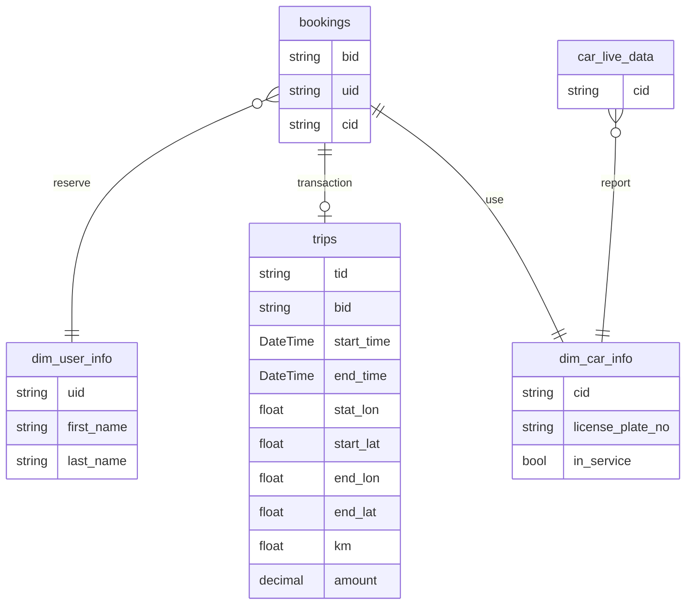
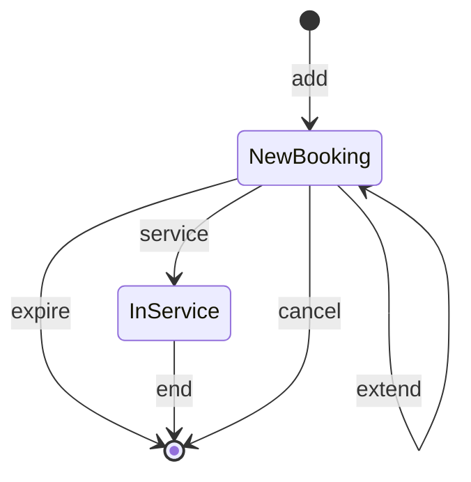

# Demo Scenario
import Tabs from '@theme/Tabs';
import TabItem from '@theme/TabItem';

This document demonstrates how to run streaming queries in Timeplus to solve various use cases.

## Customer Scenario and Data Model {#model}

You are the lead business analyst in a carsharing company. Sensors are equipped in each car to report car locations. The customers use the mobile app to find available cars nearby, book them, unlock them and hit the road. At the end of the trip, the customer parks the car, locks it, ends the trip. The payment will be proceeded automatically with the registered credit card.

There are multiple data streams in the systems:





### dim_user_info

A relative static stream with all registered user informations.

| Column      | Type   | Sample Value    |
| ----------- | ------ | --------------- |
| uid         | String | u00001          |
| first_name  | String | Foo             |
| last_name   | String | Bar             |
| email       | String | a@timeplus.io   |
| credit_card | String | 371712345678910 |
| gender      | String | F               |
| birthday    | String | 1990-01-15      |

### dim_car_info

A relative static stream with all registered cars

| Column           | Comment                                                   | Type   | Sample Value |
| ---------------- | --------------------------------------------------------- | ------ | ------------ |
| cid              | car ID                                                    | String | c00001       |
| license_plate_no |                                                           | String | KM235L       |
| in_service       | False if the car is suspended (retried or in maintenance) | Bool   | True         |

### car_live_data

A data stream with latest data from car sensors. When the car engine is started, report data every second. Otherwise, report data every half an hour.

| Column      | Comment                                                      | Type     | Sample Value            |
| ----------- | ------------------------------------------------------------ | -------- | ----------------------- |
| time        | datetime of the sensor data                                  | DateTime | 2022-01-12 23:00:58.476 |
| cid         | Car ID                                                       | String   | c00001                  |
| longitude   | current position                                             | Float    | 40.75896                |
| latitude    | current position                                             | Float    | -73.985195              |
| gas_percent | percentage of gas level, 100 means full tank                 | Decimal  | 86.12                   |
| speed_kmh   | current driving speed in KM/hour                             | Int      | 56                      |
| total_km    | this car's total distance in km. Keep increasing after trips | Float    | 3536                    |
| locked      | whether the car is locked                                    | Bool     | True                    |
| in_use      | whether someone is using the car                             | Bool     | True                    |

### bookings

A data stream with trip details and payment info. Each row is generated during the booking lifecycle

* when the user books the car, a new event with action=add, with the booking_time=now, expire=now+30m
* when the user unlock the car, a new event with action=service
* when the user completes the trip and lock the car, a new event with action=end
* when the user cancels the booking, a new event with action=cancel
* when the user extends the booking for another 30min, a new event with action=extend, and update the expire field
* if the user doesn't unlock the car before the expire time, then new event is added with action=expire




| Column       | Comment                                                     | Type     | Sample Value            |
| ------------ | ----------------------------------------------------------- | -------- | ----------------------- |
| time         | When the event happens                                      | DateTime | 2022-01-12 13:00:58.476 |
| bid          | booking ID                                                  | String   | b00001                  |
| booking_time | When the user books the car. Expire in 30min                | DateTime | 2022-01-12 13:30:58.476 |
| uid          | User ID                                                     | String   | u00001                  |
| cid          | Car ID                                                      | String   | c00001                  |
| action       | One of the values: add, cancel, extend, service, expire,end | String   | add                     |
| expire       | When the booking will be expired                            | DateTime | 2022-01-12 13:30:58.476 |

### trips

A data stream with trip details and payment info. Each row is generated at the end of the trip

| Column     | Comment                                   | Type     | Sample Value            |
| ---------- | ----------------------------------------- | -------- | ----------------------- |
| tid        | Trip ID                                   | String   | t00001                  |
| start_time | When the trip starts                      | DateTime | 2022-01-12 13:00:58.476 |
| end_time   | When the trip ends                        | DateTime | 2022-01-12 24:00:58.476 |
| bid        | booking ID                                | String   | b00001                  |
| start_lon  | Start location                            | Float    | 40.75896                |
| start_lat  | Start location                            | Float    | -73.985195              |
| end_lon    | End location                              | Float    | 42.75896                |
| end_lat    | End location                              | Float    | -71.985195              |
| distance   | distance drove in km                      | Float    | 23.2                    |
| amount     | how much the user should pay for the trip | Decimal  | 40.75                   |

The following sections show how to query Timeplus to understand the business.

## Streaming Analysis {#streaming}

### S-TAIL: Showing raw data with or without filter conditions {#s-tail}

**Use Case:** to start the data exploration, the analyst wants to show all recently reported car iot data

```sql
select * from car_live_data
```

or focusing on which cars are almost running out of gas (so that they can send service team to fill gas or suspend the car)

```sql
select time,cid,gas_percent from car_live_data where gas_percent < 25 
```

[Try in playground](https://play.timeplus.com/playground?case=s-tail)

Result:

| time                    | cid    | gas_percent | in_use |
| ----------------------- | ------ | ----------- | ------ |
| 2022-01-12 23:00:58.476 | c00001 | 18          | false  |

### S-DOWNSAMPLING: Converting detailed data points to high level data {#s-downsampling}

**Use Case:** the sensors on each car may report data from half second to every 10 seconds. The analyst may reduce the granularity and only need to save per-mintute data to downstream

```sql
select window_start,cid, avg(gas_percent) as avg_gas_percent,avg(speed_kmh) as avg_speed from
tumble(car_live_data,1m) group by window_start, cid
```

[Try in playground](https://play.timeplus.com/playground?case=s-downsampling)

Result:

| window_start            | cid    | avg_gas_percent | avg_speed |
| ----------------------- | ------ | --------------- | --------- |
| 2022-01-12 23:01:00.000 | c00001 | 34              | 35        |

More practically, the user can create a [materialized view](view#materialized-view) to automatically put downsampled data into a new stream/view.

```sql
create materialized view car_live_data_1min as
select window_start as time,cid, avg(gas_percent) as avg_gas,avg(speed_kmh) as avg_speed 
from tumble(car_live_data,1m) group by window_start, cid
```

Then the user can search the data via

```sql
select * from car_live_data_1min
```

Result:

| time                    | cid    | avg_gas | avg_speed |
| ----------------------- | ------ | ------- | --------- |
| 2022-01-12 23:01:00.000 | c00001 | 34      | 35        |


### S-AGG-RECENT: Showing aggregation for the recent data {#s-agg-recent}

**Use Case:** the analyst wants to monitor the total revenue for the past 1 hour.

Timeplus provides a special syntax to get such result easily

```sql
select sum(amount) from trips emit last 1h
```

[Try in playground](https://play.timeplus.com/playground?case=s-agg-recent)

Once the query is sumitted, it will show quite a few rows based on the past day, then show new results in a streaming fashion.

Result:

| sum(amount) |
| ----------- |
| 3500.42     |

There are other ways to get similar results, with more verbose queries

1. We can apply a global aggregation for data in recent 1 hour window. `select sum(amount) from trips where end_time > date_sub(now(), 1h)`

2. The other solution is to use hop window aggregation. Similar to the `tumble` window in [S-DOWNSAMPLING](#s-downsampling) ,the data are grouped per a fixed size time window, such a hour. Tumble windows are not overlapped to each other, so it's ideal for downsampling without data duplication (for example, for `count` aggregation, no data will be counted twice) For hop window, it will be shifted to the left or right(past or future in the timeline) with a sliding step. For example, the following query will use the hop window to get total revenue for the past 1 hour, the result will be sent out every second. `select window_start,window_end, sum(amount) from hop(trips,end_time,1s,1h) 
   group by window_start,window_end`

<!-- 
###  :no_entry_sign: S-SESSION: analyzing activities with active sessions {#s-session}

**Use Case:** the analyst wants to track the daily movement of the car. The sensors on the cars report data every half second while the engine is started, and  report data every half an hour when the engine is off. So the session idle time can be set as 20minutes.

First, they can run the following query to get the trip distance for each car:

```sql
select cid,window_start,window_end,max(total_km)-min(total_km) as trip_km 
from session(car_live_data,20m) group by cid, window_start, window_end
```

[Try in playground](https://play.timeplus.com/playground?case=s-session)

Result:

| cid    | window_start            | window_end              | trip_km |
| ------ | ----------------------- | ----------------------- | ------- |
| c00001 | 2022-01-12 10:00:00.000 | 2022-01-12 10:23:00.000 | 5.2     |
| c00001 | 2022-01-12 13:00:00.000 | 2022-01-12 13:43:00.000 | 12      |
| c00002 | 2022-01-12 10:00:00.000 | 2022-01-12 10:15:00.000 | 4.1     |

Then create a more complex query to aggregate the data by car id and trip ending time.

```sql
with query_1 as (
select cid,window_start as w_start,window_end as w_end,max(total_km)-min(total_km) as trip_km 
from session(car_live_data,20m) group by cid, window_start, window_end
)
select cid,window_start,window_end,sum(trip_km) 
from tumble(query_1,w_end,1d) group by cid,window_start,window_end
```

Result:

| cid    | window_start            | window_end              | trip_km |
| ------ | ----------------------- | ----------------------- | ------- |
| c00001 | 2022-01-12 00:00:00.000 | 2022-01-12 23:59:59.999 | 17.2    |
| c00002 | 2022-01-12 00:00:00.000 | 2022-01-12 23:59:59.999 | 4.1     |

This query is a continuously streaming query. Every day (or every hour, depending on tumble window size), the analysis results can be sent to email/slack or a Kafka topic for further processing.

:::danger

Session window won't be not supported before March 202

:::

-->

### S-TIME-TRAVEL: Going back to a past time and run analysis since then {#s-time-travel}

**Use Case:** the analysts don't need to keep watching the streaming charts or dashboards. They can rewind to a past time to run the streaming analysis since that moment. This could help them to better understand what happened a few hours ago (such as midnight).

For example, the analyst wants to understand how the users book the car 2 hours ago

```sql
select window_start,count(*) from tumble(bookings,15m) 
where action='add' group by window_start 
emit last 2h
```

[Try in playground](https://play.timeplus.com/playground?case=s-time-travel)

Or they can specify an exactly timestamp, e.g.

```sql
select window_start,count(*) from tumble(bookings,15m) 
where action='add' group by window_start 
settings seek_to='2022-01-12 06:00:00.000'
```

Result:

| window_start            | count(*) |
| ----------------------- | -------- |
| 2022-01-12 06:00:00.000 | 34       |
| 2022-01-12 06:15:00.000 | 23       |

Not only the past data will be analyzed, but also the latest incoming data will be processed continuously. 

### S-MVIEW: Creating materialized view to keep latest analysis result and cache for other systems to query {#s-mview}

**Use Case:** unlike the traditional SQL queries, streaming queries never end until the user cancels it. The analysis results are kept pushing to the web UI or slack/kafka destinations. The analysts want to run advanced streaming query in Timeplus and cache the results as a materialized view. So that they can use regular SQL tools/systems to get the streaming insights as regular tables. Materialized views are also useful to downsample the data to reduce the data volume for future analysis and storage

```sql
create materialized view today_revenue as
select sum(amount) from trips where end_time > today();

-- in Timeplus or other connected SQL clients
select * from today_revenue
```

[Try in playground](https://play.timeplus.com/playground?case=s-mview)

### S-DROP-LATE: Dropping late events to get real-time aggregation insights {#s-drop-late}

**Use Case:** the streaming data may arrive late for many reasons, such as network latency, iot sensor malfunction, etc. When we run streaming analysis (such as payment per minute), we aggregate the data based on their event time (when the payment actually happened, instead of when Timeplus receives the data), and we don't want to wait for events which are significantly too late.

Watermark is a common mechanism in the streaming processing world to set the bar how late the events can be. Unlike other systems, Timeplus makes it very easy to identify late event without explicitly setting a watermark policy. 

For a query like this 

```sql
select window_start,window_end,sum(amount),count(*)
from tumble(trips,end_time,1m) group by window_start,window_end
```

[Try in playground](https://play.timeplus.com/playground?case=s-drop-late)

It will show the total payment every minute, for example

| window_start            | window_end              | sum(amount) | count(*) |
| ----------------------- | ----------------------- | ----------- | -------- |
| 2022-01-12 10:00:00.000 | 2022-01-12 10:01:00.000 | 200         | 42       |
| 2022-01-12 10:01:00.000 | 2022-01-12 10:02:00.000 | 300         | 67       |

Considering two cars are returned in the same time at 10:00:10. For tripA and trip, both of them are supposed to be calculated into the first time window. However for some reason, the data point tripA arrives in Timeplus on 10:01:15, and tripB data point arrives on 10:01:16. Timeplus will accept tripA data and add it into the 1st window aggregation, and also close the first window. The watermark will be sent to 10:01:00. So when tripB data point arrives, it's considered to be too late and won't be calculated in the streaming result. But it'll be still available when we run a historical query.

| data point | event time              | arrive time             | note                                                                                                                                                                                              |
| ---------- | ----------------------- | ----------------------- | ------------------------------------------------------------------------------------------------------------------------------------------------------------------------------------------------- |
| tripA      | 2022-01-12 10:00:10.000 | 2022-01-12 10:01:15.000 | included in 1st window, trigger the watermark change                                                                                                                                              |
| tripB      | 2022-01-12 10:00:10.000 | 2022-01-12 10:01:16.000 | its time is lower than watermark. <br />1st window has been closed(not accepting more data)<br />The data is dropped for streaming analysis. <br />Still can be analyzed with historical searches |


### S-WAIT-LATE: Waiting for extra time for late events {#s-wait-late}

**Use Case:** for more advanced use for the above case, it might be desirable for the analysts to set an extra time to wait for late events. This will make the streaming analysis not so real-time, however can include more data points, if the network latency is unpredictable.

Given the similar scenario, the query with the advanced setting is 

```sql
select window_start,window_end,sum(amount),count(*)
from tumble(trips,end_time,1m) group by window_start,window_end
emit after watermark and delay 30s
```

[Try in playground](https://play.timeplus.com/playground?case=s-wait-late)

### S-TOP-K: Getting the most common value for each streaming window {#s-top-k}

**Use Case:** the analysts want to understand which cars are booked most often every day or every hour

```sql
select window_start,top_k(cid,3) as popular_cars from tumble(bookings,1h) group by window_start
```

[Try in playground](https://play.timeplus.com/playground?case=s-top-k)

This will generate a daily report like this

| window_start            | popular_cars           |
| ----------------------- | ---------------------- |
| 2022-01-12 00:00:00.000 | ['car1','car2','car3'] |
| 2022-01-13 00:00:00.000 | ['car2','car3','car4'] |

### S-MAX-K: Getting the maximum value for each streaming window {#s-max-k}

**Use Case:** the analysts want to understand which trips are longest every day

```sql
select window_start,max_k(amount,3,bid,distance) as longest_trips from tumble(trips,1d) group by window_start
```

[Try in playground](https://play.timeplus.com/playground?case=s-max-k)

This will generate a daily report like this

| window_start            | longest_trips                                            |
| ----------------------- | -------------------------------------------------------- |
| 2022-01-12 00:00:00.000 | [(7.62,'b01',13.8),(2.45,'b02',2.37),(12.66,'b03',22.6)] |

To get the booking id for the 2nd longest tirp, you can `select ..,longest_trips[2].2 as bookingId `

### S-MIN-K: Getting the minimal value for each streaming window {#s-min-k}

**Use Case:** the analysts want to understand which trips are shortest every day

```sql
select window_start,min_k(amount,3,bid,distance) as shortest_trips from tumble(trips,1d) group by window_start
```

[Try in playground](https://play.timeplus.com/playground?case=s-min-k)

This will generate a daily report like this

| window_start            | shortest_trips                                            |
| ----------------------- | --------------------------------------------------------- |
| 2022-01-12 00:00:00.000 | [(2.56,'b06',3.10),(7.68,'b07',10.8),(10.24,'b08',15.36)] |

### S-OVER-TIME: Getting the difference/gaps for results in each time window {#s-over-time}

**Use Case:** with Timeplus, the analysts can easily compare the current minute data with last minute data.

For example, the user wants to understand how many cars are being used in each minute and how it is different than the last minute

```sql
select window_start,count(*) as num_of_trips,
lag(num_of_trips) as last_min_trips,num_of_trips-last_min_trips as gap
from tumble(trips,1m) group by window_start
```

[Try in playground](https://play.timeplus.com/playground?case=s-over-time)

Result

| window_start            | num_of_trips | last_min_trips | gap  |
| ----------------------- | ------------ | -------------- | ---- |
| 2022-01-12 10:00:00.000 | 88           | 0              | 88   |
| 2022-01-12 10:01:00.000 | 80           | 88             | -8   |
| 2022-01-12 10:02:00.000 | 90           | 80             | 10   |

This is a very powerful and userful capabilty. Besides comparing the last aggregation result, the analysts can also compare the data for the past. For example this second with the same second in last minute or last hour.

The following query comparing the number of car sensor data by each second, comparing the number of events in last m

```sql
select window_start,count(*) as num_of_events,
lag(window_start,60) as last_min,
lag(num_of_events,60) as last_min_events,
num_of_events-last_min_events as gap,
concat(to_string(to_decimal(gap*100/num_of_events,2)),'%') as change
from tumble(car_live_data,1s) group by window_start
```

Once the query starts running, for the first 1 minute, only the newer result is available. Then we can get the result from 60 windows back, so that we can compare the difference.

Result

| window_start            | num_of_events | last_min                | last_min_events | gap  | change |
| ----------------------- | ------------- | ----------------------- | --------------- | ---- | ------ |
| 2022-01-12 10:01:00.000 | 88            | 2022-01-12 10:00:00.000 | 83              | 5    | 5      |
| 2022-01-12 10:01:01.000 | 80            | 2022-01-12 10:00:01.000 | 87              | -7   | -8.75% |

### S-UNION-STREAMS: Merging multiple streams in same schema to a single stream {#s-union-streams}

**Use Case:** there can be some data streams in the same data schema but intentionally put into different streams, such as one stream for one city, or a country (for performance or regulation considerations, for example). We would like to merge the data to understand the big picture.

For example, the car sharing company starts their business in Vancouver BC first. Then expand it to Victoria, BC. Per local city government's regulation requirements, two systems are setup. The head quarter wants to show streaming analysis for both cities.

```sql
select * from trips_vancouver
union
select * from trips_victoria
```
<!-- 

### :no_entry_sign:S-JOIN-STREAMS: Querying multiple data streams in the same time {#s-join-streams}

**Use Case:** Data keeps changing, and each type of changing data is a stream. It's a common requirement to query multiple kinds of data in the same time to enrich the data, get more context and understand their correlation.

For example, we want to understand how many minutes by average between the user books the car and start the trip. The booking information in [bookings](#bookings) stream and [trips](#trips) stream contains the trip start time and end time

```sql
select avg(dateDiff('second',bookings.time,trips.end_time))
from bookings join trips on bookings.bid = trips.bid
emit periodic 1h
```

[Try in playground](https://play.timeplus.com/playground?case=s-join-streams)

Every hour, this query will show the average time for users to book and unlock the car. We set it as 1 hour, since normally the user need 10-20 minutes to walk to the car and unlock it. If we switch to other data sources, such as login activities and mobile app activities, we certainly can run streaming analysis in much smaller time window, say joining those 2 streams for each minute.


:::danger

streaming join WIP

:::

-->

## Other streaming queries we can run for this demo set {#other-queries}

### Get number of in-use cars{#num-cars}

Each car will report their status to the car_live_data stream, including the `in_use` bool flag. For the same car id, it may report `in_use=false` 2 minutes ago, then report `in_use=true` 1 minute ago. Then this car should be considered as in-use. We should not run global aggregation since we only care about the current status, not the accumulated data (each running car should report data twice a second). `tumble` window should be okay with 1 second as window size.

```sql
select window_start, count(distinct cid) from tumble(car_live_data,1s) 
where in_use group by window_start
```

[Try in playground](https://play.timeplus.com/playground?case=num-cars)

### Get the top 10 cars order by reveneue {#top10cars}

We probably want to understand which cars help the company earn most revenue  or which cars are not gaining enough revenue. This can be done with the following query

```sql
select cid,sum(amount) as revenue from trips 
inner join bookings on trips.bid=bookings.bid 
where end_time > today() group by cid 
order by revenue desc limit 10
settings query_mode='table'
```

[Try in playground](https://play.timeplus.com/playground?case=top10cars)

The result is like this

| cid    | revenue |
| ------ | ------- |
| c87850 | 675.9   |
| c30765 | 637.48  |
| c72990 | 487.36  |
| c00956 | 481.66  |
| c21898 | 479.64  |
| c96280 | 476.62  |
| c59872 | 461.2   |
| c51800 | 451.14  |
| c20995 | 445.48  |
| c04604 | 445.3   |

You can further enrich the data by looking up the car license plate from `dim_car_info`

```sql
with top10cars as (
  select cid,sum(amount) as revenue from trips 
inner join bookings on trips.bid=bookings.bid 
where end_time > today() group by cid 
order by revenue desc limit 10
)
select cid,revenue,license_plate_no from top10cars 
inner join dim_car_info on top10cars.cid=dim_car_info.cid
settings query_mode='table'
```

The result is

| cid    | revenue | license_plate_no |
| ------ | ------- | ---------------- |
| c30765 | 749.06  | OPIH21           |
| c87850 | 701.14  | 384K9Z           |
| c00956 | 522.66  | 3JHAYX           |
| c68812 | 497.12  | LR3AF9           |
| c51363 | 495.98  | B8UVY6           |
| c72990 | 487.36  | W6IZOB           |
| c91904 | 486.14  | LIHUZW           |
| c21898 | 479.64  | 1KTBIJ           |
| c20995 | 477.38  | 6GN7SP           |
| c96280 | 476.62  | YSK84J           |


## Data Transformation/filter/cleaning {#data}

### T-MASK: Scrubbing sensitive fields {#t-mask}

**Use Case:** Scrub sensitive fields of data(such as PII or payment information) to hide from downstream consumers

In this example, only the first and last 4 digits of the credit card numbers are shown during user activity analysis.

```sql
select uid,replace_regex(credit_card,'(\\d{4})(\\d*)(\\d{4})','\\1***\\3') as card 
from user_info
```

[Try in playground](https://play.timeplus.com/playground?case=t-mask)

Result:

| uid    | card        |
| ------ | ----------- |
| u00001 | 3717***8910 |

### T-DERIVE: Computing derived columns from raw data {#t-derive}

**Use Case:** Create new columns to combine informations from multiple columns in the raw data, or turn data in certain columns in other format to make them ready to be displayed.

```sql
select uid, concat(first_name,' ',last_name) as full_name,
year(today())-year(to_date(birthday)) as age from user_info
```

[Try in playground](https://play.timeplus.com/playground?case=t-derive)

Result:

| uid    | full_name | age  |
| ------ | --------- | ---- |
| u00001 | Foo Bar   | 32   |

### T-LOOKUP: Converting identifiers to more readable information {#t-lookup}

**Use Case:** While checking the car IoT data, we want to convert the car ID to its license plate number.

```sql
select time, cid, c.license_plate_no as license,gas_percent,speed_kmh from car_live_data 
inner join car_info as c 
on car_live_data.cid=c.cid 
```

[Try in playground](https://play.timeplus.com/playground?case=t-lookup)

Result:

| time                    | cid    | license | gas_percent | speed_kmh |
| ----------------------- | ------ | ------- | ----------- | --------- |
| 2022-01-12 23:00:58.476 | c00001 | KM235L  | 55          | 50        |
