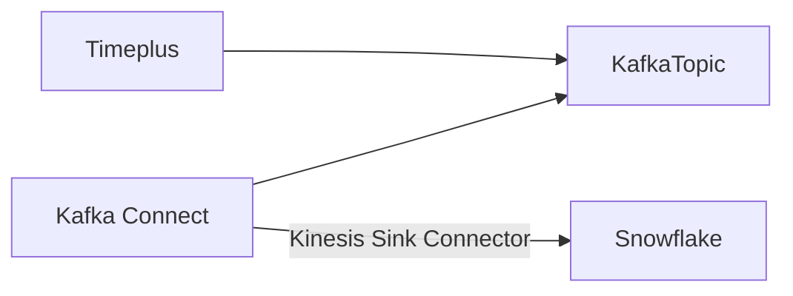
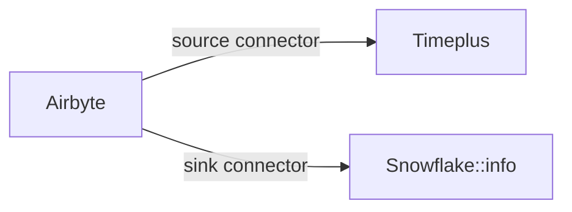

# 数据下游

使用 Timeplus 控制台，您可以轻松地探索和分析流式数据，使用直观的用户界面、标准的 SQL 和流式图表。 但您不会停留在这里。 Timeplus 使您能够向其他系统发送实时见解，以通知个人或增强下游应用程序。

## 通过电子邮件或 Slack 通知他人

当您开始运行流式查询后，您可以点击图标向其他系统发送实时结果。

### Slack

您需要创建一个 Slack 传入的 webhook，以便 Timeplus 能够在特定群组中为每个结果发送一个消息。 请按照 [Slack文档](https://api.slack.com/messaging/webhooks) 了解说明。

一旦您得到 SlackWebhook URL，您可以在对话框中指定它并设置一个消息主体。 您可以通过 `{{.column}}` 表达式提及列名称。 例如，假设查询的输出为

| 时间                      | 数量 | 备注  |
| ----------------------- | -- | --- |
| 2022-01-23 10:00:00.123 | 50 | foo |
| 2022-01-23 10:05:00.123 | 95 | Bar |

您可以设置消息主体为 `传感器数据为 {{.time}} {{.number}}，并备注: {{.note}}`

### 电子邮件地址

您可以通过指定电子邮件服务器、用户名、密码等配置 Timeplus 每个结果的电子邮件。 与 Slack 操作相似，您可以使用 `{{.column}}` 表达式来参考每个列的值。

## 发送数据到 Kafka{#kafka}

您可以利用 Timeplus 进行各种流分析，如：

* 从 iot 设备下载数据并每 5 秒获得最小/最大/平均值
* 根据以往的模式识别任何外值
* 通过移除敏感信息，删除重复，或使用尺寸表进行查找来转换数据

转换后的数据或异常事件可以发送给 Kafka 主题，供其他系统进一步处理。

要将数据发送到 Kafka，提交流式查询，然后点击图标将流式结果发送到 Kafka。 需要以下参数：

* Kafka broker(s) URL
* 主题名称：已存在的主题或指定要创建的 Timeplus 的新主题名称。
* 认证

参数详情请参考 [Kafka 源](ingestion#kafka)。 您可以向 Confluent Cloud、Confluent Platform 或自定义的 Apache Kafka 发送数据。 事件将被编码为 JSON 文档。

## 发送数据到 Snowflake{#snowflake}

您可以在 Timeplus 中应用流式分析，然后将结果发送到 Snowflake 。 有几种不同的方式来实现这一目标：

1. 您可以将流式结果发送到 Confluent Cloud 或 Kafka。 然后通过利用 [Confluent Cloud 中的 Snowflake 数据下游](https://docs.confluent.io/cloud/current/connectors/cc-snowflake-sink.html) 移动数据到 Snowflake。 这种方法可以实现更低的延迟。 请注意 Confluent Cloud Kafka 集群必须位于同一个云供应商和地区，例如，它们都位于 AWS 的 us-west-1。 默认情况下，Snowflake 中的表格将以 Kafka 主题相同的名称创建，JSON 文档保存在一个 TEXT 列 `RECORD_CONT` 中。



例如，以下查询可以在 Timeplus 中产生数据样本

```sql
select window_end as time,cid,avg(speed_kmh) as speed_kmh,max(total_km) as total_km,
avg(gas_percent) as gas_percent,min(locked) as locked,min(in_use) as in_use 
from tumble(car_live_data,2s) group by cid, window_end
```

然后创建一个 Kafka 数据下游来发送这种数据到主题：snowflake。

在 Confluent Cloud 中设置数据下游连接器后， 一个`snowflake`表格将在您的 snowflake 环境中创建指定的数据库和架构。  然后，您可以创建一个视图来平面化 JSON 文档，例如

```sql
create view downsampled as select RECORD_CONTENT:time::timestamp_tz as time,
RECORD_CONTENT:cid as cid, RECORD_CONTENT:gas_percent as gas_percent,
RECORD_CONTENT:in_use as in_use,RECORD_CONTENT:locked as locked,
RECORD_CONTENT:speed_kmh as speed_kmh,RECORD_CONTENT:total_km as total_km from snowflake
```


2. 您也可以使用其他数据集成工具来移动数据。 For example, using AirByte to load the latest data from Timeplus table, then move them to Snowflake or other destinations.



:::info

Airbyte 的 Timeplus 源插件处于早期阶段。 请联系我们来安排整合。

:::

## 通过 webhook{#webhook} 触发动作

您还可以添加自动化，以便在 Timeplus 发现任何实时见解时触发其他系统采取行动。 Simply choose the **Webhook** as the action type and optionally set a message body (by default, the entire row will be encoded as a JSON document and sent to the webhook). 您可以使用这个方法来执行基于规则的自动化，而无需人工参与。例如自动替换过热的设备，扩容或缩容服务器集群，或提醒 Slack 上的用户等。 请检查 [这个博客](https://www.timeplus.com/post/build-a-real-time-security-app-in-3-easy-steps) 来了解真实示例。


## Sink API
If you need to call an API to create a sink, here are the references.

### kafka

refer to [https://kafka.apache.org/](https://kafka.apache.org/)

| Property                 | Required | 描述                                                                                                                                                 | Default  |
| ------------------------ | -------- | -------------------------------------------------------------------------------------------------------------------------------------------------- | -------- |
| brokers                  | yes      | Specifies the list of broker addresses. This is a comma-separated string. such as `kafka1:9092,kafka2:9092,kafka3:9092`                            | |        |
| 主题                       | yes      | Specifies the Kafka topic to send data to                                                                                                          |          |
| batch_count              | no       | Specifies the number of event in each batch                                                                                                        | `1000`   |
| data_type                | no       | Specifies the data type to use for creating the stream.   support `json`                                                                           |          |
| sasl                     | no       | Specifies the Simple Authentication and Security Layer (SASL) mechanism for authentication. support `none`,`plain`,`scram-sha-256`,`scram-sha-512` | `none` | |
| username                 | no       | Specifies the username for authentication                                                                                                          |          |
| password                 | no       | Specifies the password for authentication                                                                                                          |          |
| tls.disable              | no       | If set to `true`, disables TLS encryption                                                                                                          | `false`  |
| tls.skip_verify_server | no       | If set to `true`, skips server certificate verification when using TLS                                                                             | `false`  |


### http

| Property       | Required | 描述                                                | Default |
| -------------- | -------- | ------------------------------------------------- | ------- |
| url            | yes      | Specifies the URL of http                         |         |
| content_type   | no       | Specifies the content type                        |         |
| http_method    | no       | Specifies the password for authentication         | `POST`  |
| payload_field  | no       | The payload of the http request                   |         |
| http_header    | no       | http header object                                | `{}`    |
| oauth2         | no       | Specifies oauth2 configuration. refer to `oauth2` |         |
| paralism       | no       | Specifies the paralism number schema              | `1`     |
| retries        | no       | Specifies the retries number                      | `0`     |
| retry_interval | no       | Specifies the interval between retries            | `10s`   |
| timeout        | no       | http timeput interval                             | `10s`   |


#### oauth2

| Property      | Required | 描述                      | Default |
| ------------- | -------- | ----------------------- | ------- |
| enabled       | no       | wether to enable oauth2 | `false` |
| client_key    | no       | client key              |         |
| client_secret | no       | client secret           |         |
| token_url     | no       | token URL               |         |
| scopes        | no       | scopes, list of strings |         |


### slack

refer to [https://slack.com/](https://slack.com/)

| Property | Required | 描述                                                                                                                                                                                               | Default |
| -------- | -------- | ------------------------------------------------------------------------------------------------------------------------------------------------------------------------------------------------ | ------- |
| url      | yes      | the webhook URL of the slack channel, which is considerred as a secret                                                                                                                           |         |
| template | no       | the template used to send query result to slack, use `{{ .field_name }}` to replace the field of query result you want to reference. in case it is empty, will encode the event into JSON format |         |
| header   | no       | the http header                                                                                                                                                                                  | `{}`    |


### timeplus

send query result to another timeplus stream

| Property    | Required | 描述                            | Default |
| ----------- | -------- | ----------------------------- | ------- |
| stream_name | yes      | the name of the target stream |         |


### clickhouse

refer to [https://clickhouse.com/](https://clickhouse.com/)

| Property       | Required | 描述                                                                                                                               | Default |
| -------------- | -------- | -------------------------------------------------------------------------------------------------------------------------------- | ------- |
| table_name     | yes      | Specifies the name of the target ClickHouse table                                                                                |         |
| dsn            | yes      | Specifies the ClickHouse Data Source Name (DSN). When specified, `hosts`, `username`, `password`, and `database` will be ignored |         |
| hosts          | yes*     | Specifies the list of ClickHouse server hosts                                                                                    |         |
| username       | yes*     | Specifies the username for authentication                                                                                        |         |
| password       | yes*     | Specifies the password for authentication                                                                                        |         |
| database       | yes*     | Specifies the ClickHouse database to use                                                                                         |         |
| engine         | yes*     | Specifies the ClickHouse table engine to use                                                                                     |         |
| suffix         | yes*     | Specifies a suffix to be added to the create table script                                                                        |         |
| init_sql       | yes      | Specifies initial SQL to create the table. When specified, it ignores `engine` and `suffix`                                      |         |
| batch_count    | no       | Specifies the batch count for data ingestion                                                                                     | `128`   |
| batch_duration | no       | Specifies the batch duration for data ingestion                                                                                  | `100ms` |

### pulsar

refer to [https://pulsar.apache.org/](https://pulsar.apache.org/)

| Property    | Required | 描述                                                                     | Default |
| ----------- | -------- | ---------------------------------------------------------------------- | ------- |
| 主题          | yes      | Specifies the topic of the pulsar to connect to                        |         |
| 经纪网址        | yes      | Specifies the URL of the broker to connect to                          |         |
| auth_type   | yes      | Specifies the authentication type to use.  support ``,`oauth2`,`token` |         |
| auth_params | no       | Specifies authentication parameters as key-value pairs                 | `{}`    |
