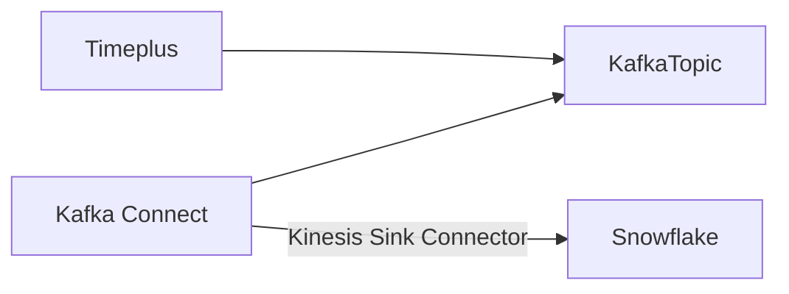
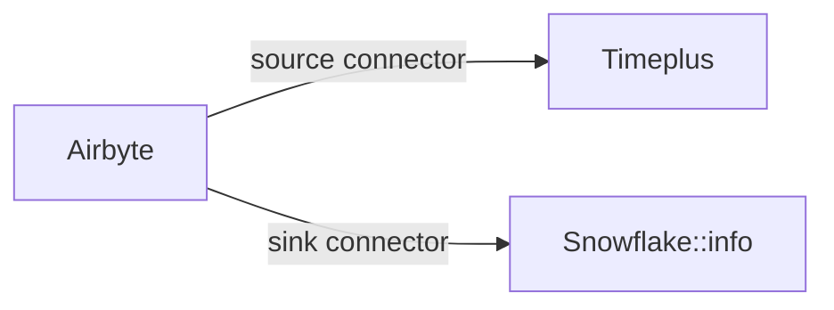

# 数据下游

使用 Timeplus 控制台，您可以轻松地探索和分析流式数据，使用直观的用户界面、标准的 SQL 和流式图表。 但您不会停留在这里。 Timeplus 使您能够向其他系统发送实时见解，以通知个人或增强下游应用程序。

## 通过电子邮件或 Slack 通知他人

当您开始运行流式查询后，您可以点击图标向其他系统发送实时结果。

### Slack

您需要创建一个 Slack 传入的 webhook，以便 Timeplus 能够在特定群组中为每个结果发送一个消息。 请按照 [Slack文档](https://api.slack.com/messaging/webhooks) 了解说明。

一旦您得到 SlackWebhook URL，您可以在对话框中指定它并设置一个消息主体。 您可以通过 `{{.column}}` 表达式提及列名称。 例如，假设查询的输出为

| 时间                      | 数量 | 备注  |
| ----------------------- | -- | --- |
| 2022-01-23 10:00:00.123 | 50 | foo |
| 2022-01-23 10:05:00.123 | 95 | Bar |

您可以设置消息主体为 `传感器数据为 {{.time}} {{.number}}，并备注: {{.note}}`

### 电子邮件地址

您可以通过指定电子邮件服务器、用户名、密码等配置 Timeplus 每个结果的电子邮件。 与 Slack 操作相似，您可以使用 `{{.column}}` 表达式来参考每个列的值。

## 发送数据到 Kafka{#kafka}

您可以利用 Timeplus 进行各种流分析，如：

* 从 iot 设备下载数据并每 5 秒获得最小/最大/平均值
* 根据以往的模式识别任何外值
* 通过移除敏感信息，删除重复，或使用尺寸表进行查找来转换数据

转换后的数据或异常事件可以发送给 Kafka 主题，供其他系统进一步处理。

要将数据发送到 Kafka，提交流式查询，然后点击图标将流式结果发送到 Kafka。 需要以下参数：

* Kafka broker(s) URL
* 主题名称：已存在的主题或指定要创建的 Timeplus 的新主题名称。
* 认证

Please refer to the [Kafka source](/ingestion#kafka) for details of the parameters. 您可以向 Confluent Cloud、Confluent Platform 或自定义的 Apache Kafka 发送数据。 事件将被编码为 JSON 文档。

## 发送数据到 Snowflake{#snowflake}

您可以在 Timeplus 中应用流式分析，然后将结果发送到 Snowflake 。 有几种不同的方式来实现这一目标：

1. 您可以将流式结果发送到 Confluent Cloud 或 Kafka。 然后通过利用 [Confluent Cloud 中的 Snowflake 数据下游](https://docs.confluent.io/cloud/current/connectors/cc-snowflake-sink.html) 移动数据到 Snowflake。 这种方法可以实现更低的延迟。 默认情况下，Snowflake 中的表格将以 Kafka 主题相同的名称创建，JSON 文档保存在一个 TEXT 列 `RECORD_CONT` 中。 请注意 Confluent Cloud Kafka 集群必须位于同一个云供应商和地区，例如，它们都位于 AWS 的 us-west-1。



例如，以下查询可以在 Timeplus 中产生数据样本

```sql
select window_end as time,cid,avg(speed_kmh) as speed_kmh,max(total_km) as total_km,
avg(gas_percent) as gas_percent,min(locked) as locked,min(in_use) as in_use 
from tumble(car_live_data,2s) group by cid, window_end
```

然后创建一个 Kafka 数据下游来发送这种数据到主题：snowflake。

在 Confluent Cloud 中设置数据下游连接器后， 一个`snowflake`表格将在您的 snowflake 环境中创建指定的数据库和架构。  然后，您可以创建一个视图来平面化 JSON 文档，例如

```sql
create view downsampled as select RECORD_CONTENT:time::timestamp_tz as time,
RECORD_CONTENT:cid as cid, RECORD_CONTENT:gas_percent as gas_percent,
RECORD_CONTENT:in_use as in_use,RECORD_CONTENT:locked as locked,
RECORD_CONTENT:speed_kmh as speed_kmh,RECORD_CONTENT:total_km as total_km from snowflake
```


2. 您也可以使用其他数据集成工具来移动数据。 例如，使用 AirByte 从 Timeplus 表中加载最新数据，然后将其移动到 Snowflake 或其他目的地。



:::info

Airbyte 的 Timeplus 源插件处于早期阶段。 请联系我们来安排整合。

:::

## 通过 webhook{#webhook} 触发动作

您还可以添加自动功能，在Timeplus发现任何实时见解时触发其他系统采取行动。 只需选择**Webhook**作为操作类型，并可选地设置消息内容（默认情况下，整行将被编码为 JSON 文档并发送到 webhook）。 您可以使用这种方法来执行基于规则的自动化，无需人为干预，例如更换过热的设备、向上扩展到缩小服务器群的规模，或者提醒用户使用 slack 等。 请检查 [这个博客](https://www.timeplus.com/post/build-a-real-time-security-app-in-3-easy-steps) 来了解真实示例。


## Sink API
如果您需要调用 API 来创建数据下游，以下是参考资料。

### kafka

请参考 [https://kafka.apache.org/](https://kafka.apache.org/)

| 属性                       | 必填项 | 描述                                                                          | 默认值      |
| ------------------------ | --- | --------------------------------------------------------------------------- | -------- |
| brokers                  | yes | 指定broker地址列表。 这是一个以逗号分隔的字符串。 例如`kafka1:9092,kafka2:9092,kafka3:9092`        | |        |
| 主题                       | yes | 指定要向其发送数据的 Kafka 主题                                                         |          |
| batch_count              | no  | 指定每批事件的数量                                                                   | `1000`   |
| data_type                | no  | 指定用于创建流的数据类型。   支持`json`                                                    |          |
| sasl                     | no  | 指定用于简单身份验证和安全层（SASL）的认证机制。 支持`none`，`plain`，`scram-sha-256`，`scram-sha-512` | `none` | |
| 用户名                      | no  | 指定用于身份验证的用户名                                                                |          |
| 密码                       | no  | 指定用于身份验证的密码                                                                 |          |
| tls.disable              | no  | 如果设置为`true`，则禁用 TLS 加密                                                      | `false`  |
| tls.skip_verify_server | no  | 如果设置为`true`，则在使用 TLS 时会跳过服务器证书验证                                            | `false`  |


### http

| 属性             | 必填项 | 描述                       | 默认值    |
| -------------- | --- | ------------------------ | ------ |
| url            | yes | 指定 http 网址               |        |
| content_type   | no  | 指定内容类型                   |        |
| http_method    | no  | 指定用于身份验证的密码              | `POST` |
| payload_field  | no  | http 请求的有效载荷             |        |
| http_header    | no  | http 标头对象                | `{}`   |
| oauth2         | no  | 指定 oauth2 配置。 参考`oauth2` |        |
| paralism       | no  | 指定 paralism 参数架构         | `1`    |
| retries        | no  | 指定重试次数                   | `0`    |
| retry_interval | no  | 指定重试间隔                   | `10s`  |
| timeout        | no  | http 超时间隔                | `10s`  |


#### oauth2

| 属性            | 必填项 | 描述          | 默认值     |
| ------------- | --- | ----------- | ------- |
| enabled       | no  | 是否启用 oauth2 | `false` |
| client_key    | no  | 客户端密钥       |         |
| client_secret | no  | 客户端机密       |         |
| token_url     | no  | 令牌网址        |         |
| scopes        | no  | 范围，字符串列表    |         |


### slack

请参考[https://slack.com/](https://slack.com/)

| 属性       | 必填项 | 描述                                                                                | 默认值  |
| -------- | --- | --------------------------------------------------------------------------------- | ---- |
| url      | yes | slack 频道的 webhook 网址，这被视为秘密                                                       |      |
| template | no  | 用于向 slack 发送查询结果的模板，用于替换 `{{ .field_name }}` 要引用的查询结果字段。 如果需求是空的，则会将事件编码为 JSON 格式 |      |
| header   | no  | http 标头                                                                           | `{}` |


### timeplus

将查询结果发送到另一个 timeplus 流

| 属性          | 必填项 | 描述     | 默认值 |
| ----------- | --- | ------ | --- |
| stream_name | yes | 目标流的名称 |     |


### clickhouse

请参考[https://clickhouse.com/](https://clickhouse.com/)

| 属性             | 必填项  | 描述                                                         | 默认值     |
| -------------- | ---- | ---------------------------------------------------------- | ------- |
| table_name     | yes  | 指定目标 ClickHouse 表的名称                                       |         |
| dsn            | yes  | 指定 ClickHouse 数据源名称（DSN）。 当你指定后， `主机`，`用户名`，`密码`，`数据库`将被忽略 |         |
| hosts          | yes* | 指定 ClickHouse 服务器主机列表                                      |         |
| 用户名            | yes* | 指定用于身份验证的用户名                                               |         |
| 密码             | yes* | 指定用于身份验证的密码                                                |         |
| 数据库            | yes* | 指定要使用的 ClickHouse 数据库                                      |         |
| 引擎             | yes* | 指定要使用的 ClickHouse 表引擎                                      |         |
| suffix         | yes* | 指定要添加到创建表脚本中的后缀                                            |         |
| init_sql       | yes  | 指定初始 SQL 来创建表。 当你指定后，它会忽略`引擎`和`后缀`                         |         |
| batch_count    | no   | 指定数据提取的批次数                                                 | `128`   |
| batch_duration | no   | 指定数据提取的批处理时间                                               | `100ms` |

### pulsar

请参考[https://pulsar.apache.org/](https://pulsar.apache.org/)

| 属性          | 必填项 | 描述                                     | 默认值  |
| ----------- | --- | -------------------------------------- | ---- |
| 主题          | yes | 指定要连接的pulsar的主题                        |      |
| 经纪网址        | yes | 指定要连接的broker URL                       |      |
| auth_type   | yes | 指定要使用的身份验证类型。  支持``，`oauth2`，`token` |      |
| auth_params | no  | 将身份验证参数指定为键值对                          | `{}` |
