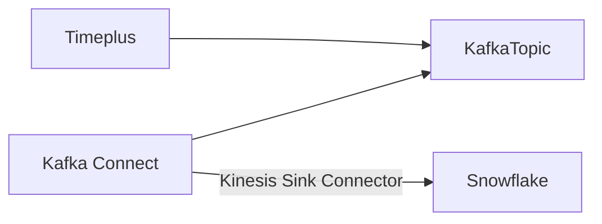
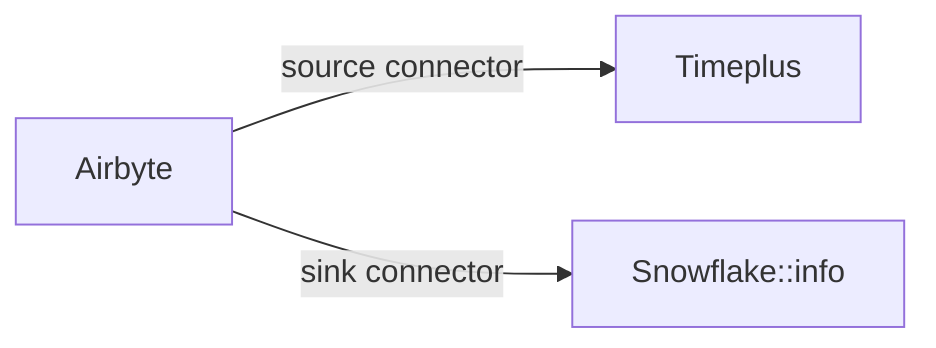

# 数据下游

使用 Timeplus 控制台，您可以轻松地探索和分析流式数据，使用直观的用户界面、标准的 SQL 和流式图表。 但您不会停留在这里。 Timeplus 使您能够向其他系统发送实时见解，以通知个人或增强下游应用程序。

## 通过电子邮件或 Slack 通知他人

当您开始运行流式查询后，您可以点击图标向其他系统发送实时结果。

### Slack

您需要创建一个 Slack 传入的 webhook，以便 Timeplus 能够在特定群组中为每个结果发送一个消息。 请按照 [Slack文档](https://api.slack.com/messaging/webhooks) 了解说明。

一旦您得到 SlackWebhook URL，您可以在对话框中指定它并设置一个消息主体。 您可以通过 `{{.column}}` 表达式提及列名称。 例如，假设查询的输出为

| 时间                      | 数字 | 备注  |
| ----------------------- | -- | --- |
| 2022-01-23 10:00:00.123 | 50 | foo |
| 2022-01-23 10:05:00.123 | 95 | Bar |

您可以设置消息主体为 `传感器数据为 {{.time}} {{.number}}，注: {{.note}}`

### 电子邮件地址

您可以通过指定电子邮件服务器、用户名、密码等配置Timeplus每个结果的电子邮件。 与Slack 操作相似，您可以使用 `{{.column}}` 表达式来参考每个列的值。

## 发送数据到 Kafka{#kafka}

您可以利用Timeplus进行各种流分析，如：

* 从 iot 设备下载数据并每5秒获得最小/最大/平均值
* 根据以往的模式识别任何外值
* 通过移除敏感信息，删除重复，或使用尺寸表进行查找来转换数据

转换后的数据或异常事件可以发送给Kafka专题，供其他系统进一步处理。

要将数据发送到 Kafka，提交流式查询，然后点击图标将流式结果发送到 Kafka。 需要以下参数：

* Kafka broker(s) URL
* 主题名称：已存在的主题或指定要创建的Timeplus的新主题名称。
* 认证

参数详情请参考 [Kafka 源](ingestion#kafka)。 您可以向Confluent Cloud、Confluent Platform或自定义的 Apache Kafka发送数据。 事件将被编码为JSON文档。

## 发送数据到 Snowflake{#snowflake}

您可以在 Timeplus 中应用流式分析，然后将结果发送到 Snowflake 。 有几种不同的方式来实现这一目标：

1. 您可以将流式结果发送到Confluent Cloud或 Kafka。 然后通过 [Cloud 中的雪花吸收器](https://docs.confluent.io/cloud/current/connectors/cc-snowflake-sink.html) 移动数据到雪花。 这种做法的延迟率将较低。 请注意Confluent Cloud Kafka群集必须居住在同一个云供应商和地区，例如，它们都位于AWS的西端。 默认， Snowflake中的表格将以 Kafka 主题相同的名称创建，JSON 文档保存在一个 TEXT 列 `RECORD_CONT` 中。



例如，以下查询可以在Timeplus中产生数据样本

```sql
select window_end as time,cid,avg(speed_kmh) as speed_kmh,max(total_km) as total_km,
avg(gas_percent) as gas_percent,min(locked) as locked,min(in_use) as in_use 
from tumble(car_live_data,2s) group by cid, window_end
```

然后创建一个Kafka sink 来发送这种数据到主题：雪花。

在 Confluent Cloud中设置汇水器后， a `雪花` 表将在你的雪花环境中创建指定的数据库和架构。  然后您可以创建一个视图来平整JSON文档，例如：

```sql
create view downsampled as select RECORD_CONTENT:time::timestamp_tz as time,
RECORD_CONTENT:cid as cid, RECORD_CONTENT:gas_percent as gas_percent,
RECORD_CONTENT:in_use as in_use,RECORD_CONTENT:locked as locked,
RECORD_CONTENT:speed_kmh as speed_kmh,RECORD_CONTENT:total_km as total_km from snowflake
```


2. 您也可以使用其他数据集成工具来移动数据。 例如，使用 AirByte 从Timeplus 表中加载最新数据，然后将其移动到雪花或其他目的地。



:::info

Airbyte的 Timeplus 源插件处于早期阶段。 请联系我们来安排整合。

:::

## 通过 webhook{#webhook} 触发动作

当Timeplus找到任何实时见解时，您也可以添加自动化来触发其他系统的动作。 只需选择 **Webhook** 作为动作类型，并可选地设置消息内容(默认情况下) 整个行将被编码为 JSON 文档并发送到 webhook。 您可以使用这个方法来执行基于规则的自动化，而无需人工参与。 例如自动替换过热的设备，扩容或缩容服务器集群，或提醒Slack上的用户等。 请检查 [这个博客](https://www.timeplus.com/post/build-a-real-time-security-app-in-3-easy-steps) 来了解真实世界的例子。