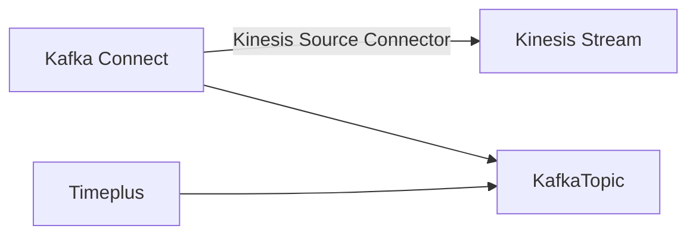

# 流传数据

Timeplus支持广泛的数据来源。

## 通过 web 控制台添加新源

### 从Apache Kafka加载流数据 {#kafka}

截至今天，Kafka是Timeplus的原始数据来源(和汇)。 通过与Confluent的强大伙伴关系，我们可以将来自Confluent Cloud、Confluent Platform或Apache Kafka的实时数据加载到TimePlus流式引擎。 (最近引入了一个新功能来创建 [个外部流](working-with-streams#external_stream) 来分析Confluent/Kafka/Redpanda 中的数据而不移动数据)

[了解更多。](kafka-source)

### 从 Apache Pulsar 加载流数据 {#pulsar}

Apache® PulsarTM 是一个云端、分发、开源消息和流式平台，用于实时工作量。 Recently Timeplus added the first-class integration for Apache Pulsar as both a data source and a data sink.

[了解更多。](pulsar-source)

### 从 Kinesis 加载流式数据 {#kinesis}

If your streaming data resides in [Amazon Kinesis Data Stream](https://aws.amazon.com/kinesis/data-streams/), you can load them into Timeplus in two steps.

1.  首先通过 [将Kinesis 源连接器为 Confluent Cloud](https://docs.confluent.io/cloud/current/connectors/cc-kinesis-source.html) 或 [Amazon Kinesis 源连接器将Kinesis 数据加载到 Kafka 主题](https://docs.confluent.io/kafka-connect-kinesis/current/overview.html)
2. 使用 Timeplus 上面的Kafka 源将数据加载到流中。

数据流可以用以下方式说明：

### 上传本地文件

如果您有一些静态数据集或查找CSV格式的表，您可以直接上传文件到Timeplus。

1. 点击 **从导航菜单中添加数据**。 Then click **Import from CSV** button
2. 从您的本地文件系统拖放一个 CSV 文件来上传文件。 (COMING SOON: if your file is downloadable from a URL or S3 bucket, you can create a source to have Timeplus server to load it. File formats other than CSV will be supported too.)
3. Choose whether the first row of the file is the column header.
4. Specify a name for the stream, and optionally provide a readable description.
5. Click the button to start uploading data and click the **View Imported Data** button to run a query to review imported data.

### 加载示例流数据

如果您没有准备好将您的真实数据加载到Timeplus中，或者只是想要与系统一起玩， 您可以使用此功能加载一些采样流数据。 We provide 3 typical streaming data.

1. `iot` will generate data for 3 devices(device_0, device_1 and device_2). `数字` 值可以是 0 到 100 之间。 The `time` column is when the event is generated.
2. `user_logins` will generate data for 2 users(user1 and user2), from 2 possible `city` values: Shanghai or Beijing. The `time` column is when the event is generated.
3. `devops` 将生成3 `主机名`(host_0,host_1, 和 host_2, 从 3 可能的 `区域`(eu-central-1, us-west-1, sa-east-1), 3 可能的 `机车`(1,2,3), 数字 `usage_user` 从 0 到 100 `用法系统` 从 0 到 100 和 `时间` 列为事件时间。

You can load such sample data via the **Add Data** button and the **Sample Dataset** option. 您可以为数据创建新流或选择现有流。

## 通过 REST 或 SDK 将数据推送到 Timeplus {#push}

Timeplus 提供数据导入REST API 和相关的不同的编程语言软件开发工具包SDK。 开发人员可以利用这些 REST API 或 SDK 将实时数据推送到 Timeplus。

[了解更多。](ingest-api)

## 通过第三方工具加载其他数据到 Timeplus

Timeplus可与数据生态系统合作，并可利用各种工具加载数据，甚至在摄取时进行数据转换。

### DataPM（用于文件和数据库） {#datapm}
Data Package Manager (datapm) 是一个[开源](https://github.com/big-armor/datapm)数据发布平台，供私人和公共使用。 datapm 命令行工具使得在系统之间无缝移动数据，而且易于重复。 我们为datapm开发了一个特殊的Timeplus sink，可以开箱即用发送各种数据到Timeplus。

[了解更多。](datapm)

### Airbyte

AirByte提供开放源码软件版本和管理云以收集数据、转换数据和发送到其他目的地。

高级别会议

1. AirByte 可以从许多不同的数据来源获取数据，包括数据库/DC或基础设施日志、应用程序日志，甚至商业应用程序(例如Salesforce)
2. 数据可以通过 AirByte 内置能力正常化。 或者可以先将其保存到目的地数据库，然后依靠dbt或其他工具进行转换/实现。
3. Data collected by AirByte can be sent to many destinations, including Timeplus.

只需命名来自Airby的几个数据源：

* App marketplace such as Apple App Store
* AWS Cloudtrail
* Google BigQuery
* 使用 Gzip/Zip/xz/Snappy 压缩从 S3/GCS/SFTP/本地加载文件，在 CSV/JSON/XML/Excel/Parquet/etc
* Github, GitLab, or JIRA活动
* Google 广告
* Instagram 社交媒体
* Slack或微软团队
* PostgreSQL, RedShift, Snowflake, MongoDB, MySQL, Microsoft SQL Server, 等等。

:::info

Airbyte的 Timeplus 目标插件正处于早期阶段。 请联系我们来安排整合。

:::

### Kafka 连接器

You can use Kafka Connectors to load data from popular data sources into Confluent Cloud, Confluent Platform, or Apache Kafka, then use Timeplus to load them into streams via the built-in Kafka Source.

有几个可以通过Kafka Connects进入Timeplus的数据源例子。 详情请查看 https://www.confluent.io/product/confluent-connectors/。

* Apache ActiveMQ
* Amazon CloudWatch Logs
* [Amazon Kinesis](#kinesis)
* Amazon S3
* Amazon SQS
* Azure Blob Storage
* Azure Event Hubs
* CockroachDB CDC
* Databricks
* Github
* Google Cloud Pub/Sub
* IBM MQ
* InfluxDB
* JDBC
* Microsoft SQL Server
* MongoDB
* MQTT
* MySQL CDC
* Neo4j
* Oracle Database
* PostgreSQL CDC
* RabbitMQ
* Salesforce
* ServiceNow
* SFTP
* SNMP
* Splunk
* TiDB CDC
* Tigergraph
* Zendesk
