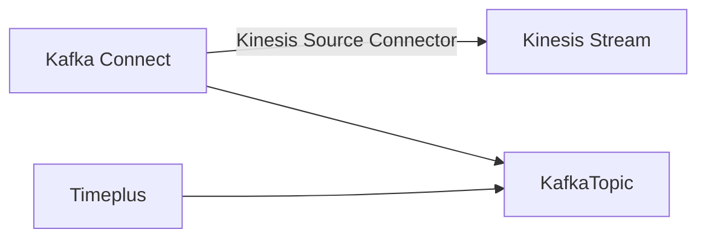

# 数据收集

Timeplus supports multiple ways to load data into the system, or access the external data without copying them in Timeplus:

- [External Stream for Apache Kafka](/external-stream), Confluent, Redpanda, and other Kafka API compatible data streaming platform. This feature is also available in Timeplus Proton.
- [External Stream for Apache Pulsar](/pulsar-external-stream) is available in Timeplus Enterprise 2.5 and above.
- [Source](/source) for extra wide range of data sources. 这仅在 Timeplus Enterprise 中可用。 This integrates with [Redpanda Connect](https://redpanda.com/connect), supporting 200+ connectors.
- On Timeplus web console, you can also [upload CSV files](#csv) and import them into streams.
- For Timeplus Enterprise, [REST API](/ingest-api) and SDKs are provided to push data to Timeplus programmatically.
- On top of the REST API and SDKs, Timeplus Enterprise adds integrations with [Kafka Connect](/kafka-connect), [AirByte](https://airbyte.com/connectors/timeplus), [Sling](/sling), seatunnel and [datapm](/datapm).
- Last but not the least, if you are not ready to load your real data into Timeplus, or just want to play with the system, you can use the web console to [create sample streaming data](#streamgen), or [use SQL to create random streams](/proton-create-stream#create-random-stream).

## 通过 web 控制台添加新源

### 从Apache Kafka加载流数据 {#kafka}

截至今天，Kafka是Timeplus的主要数据集成。 通过与Confluent的强大伙伴关系，我们可以将来自Confluent Cloud、Confluent Platform或Apache Kafka的实时数据加载到TimePlus流式引擎。 You can also create [external streams](/external-stream) to analyze data in Confluent/Kafka/Redpanda without moving data.

[了解更多。](/kafka-source)

### 从 Apache Pulsar 加载流数据 {#pulsar}

Apache® PulsarTM 是一个云端、分发、开源消息和流式平台，用于实时工作量。 Timeplus增加了对Apache Pulsar的集成，它既是数据源又是数据下游。

[了解更多。](/pulsar-source)

### 从 Kinesis 加载流式数据 {#kinesis}

如果您的流数据在 [Amazon Kinesis 数据流](https://aws.amazon.com/kinesis/data-streams/) 中，您可以分两步把它们加载到 Timeplus中。

1.  首先通过 [将Kinesis 源连接器为 Confluent Cloud](https://docs.confluent.io/cloud/current/connectors/cc-kinesis-source.html) 或 [Amazon Kinesis 源连接器将Kinesis 数据加载到 Kafka 主题](https://docs.confluent.io/kafka-connect-kinesis/current/overview.html)
2.  使用 Timeplus 上面的Kafka 源将数据加载到流中。

数据流可以用以下方式说明：

### 上传本地文件 {#csv}

如果您有一些静态数据集或查找CSV格式的表，您可以直接上传文件到Timeplus。

1. 点击 **从导航菜单中添加数据**。 然后点击 **从 CSV 导入** 按钮
2. 从您的本地文件系统拖放一个 CSV 文件来上传文件。 （即将推出：如果您的文件是从 URL 或 S3 存储桶中下载，那么您可以创建数据源来让 Timeplus 服务器加载该文件。 CSV 以外的文件格式也将得到支持。
3. 选择文件的第一行是否为列标题。
4. 为流指定一个名称，并可选择提供一个可读的描述。
5. 单击按钮开始上传数据，然后单击 **查看导入的数据** 按钮运行查询以查看导入的数据。

### 加载示例流数据 {#streamgen}

如果您没有准备好将您的真实数据加载到Timeplus中，或者只是想要与系统一起玩， 您可以使用此功能加载一些采样流数据。 我们提供了三个典型的流数据。

1. `iot` 将生成3台设备（device_0，device_1 和 device_2）的数据。 `数字` 值可以是 0 到 100 之间。 `时间` 列是事件生成的时间。
2. `user_logins` 将从两个可能的 `城市` 的值：上海或北京中生成两个用户的数据（用户1和用户2）。 `时间` 列是事件生成的时间。
3. `devops` 将生成3 `主机名`(host_0,host_1, 和 host_2, 从 3 可能的 `区域`(eu-central-1, us-west-1, sa-east-1), 3 可能的 `机车`(1,2,3), 数字 `usage_user` 从 0 到 100 `用法系统` 从 0 到 100 和 `时间` 列为事件时间。

您可以通过 **添加数据** 菜单和 **示例数据** 选项加载这些样本数据。 您可以为数据创建新流或选择现有流。

## 通过 REST 或 SDK 将数据推送到 Timeplus {#push}

Timeplus 提供数据导入REST API 和相关的不同的编程语言软件开发工具包SDK。 开发人员可以利用这些 REST API 或 SDK 将实时数据推送到 Timeplus。

[了解更多。](/ingest-api)

## 通过第三方工具加载其他数据到 Timeplus

Timeplus可与数据生态系统合作，并可利用各种工具加载数据，甚至在摄取时进行数据转换。

### DataPM（用于文件和数据库） {#datapm}

Data Package Manager (datapm) 是一个[开源](https://github.com/big-armor/datapm)数据发布平台，供私人和公共使用。 datapm 命令行工具使得在系统之间无缝移动数据，而且易于重复。 我们为datapm开发了一个特殊的Timeplus sink，可以开箱即用发送各种数据到Timeplus。

[了解更多。](/datapm)

### Airbyte

AirByte提供开放源码软件版本和管理云以收集数据、转换数据和发送到其他目的地。

高级别会议

1. AirByte 可以从许多不同的数据来源获取数据，包括数据库/DC或基础设施日志、应用程序日志，甚至商业应用程序(例如Salesforce)
2. 数据可以通过 AirByte 内置能力正常化。 或者可以先将其保存到目的地数据库，然后依靠dbt或其他工具进行转换/实现。
3. AirByte 收集的数据可以发送到许多目的地，包括 Timeplus。

只需命名来自Airby的几个数据源：

- 应用市场，如苹果应用商店
- AWS Cloudtrail
- Google BigQuery
- 使用 Gzip/Zip/xz/Snappy 压缩从 S3/GCS/SFTP/本地加载文件，在 CSV/JSON/XML/Excel/Parquet/etc
- Github, GitLab, or JIRA活动
- Google 广告
- Instagram 社交媒体
- Slack或微软团队
- PostgreSQL, RedShift, Snowflake, MongoDB, MySQL, Microsoft SQL Server, 等等。

:::info

Airbyte的 Timeplus 目标插件正处于早期阶段。 请联系我们来安排整合。

:::

### Kafka 连接器

您可以使用 Kafka Connector 将数据源中的数据加载到 Confluent Cloud，Confluent Platform 或 Apache Kafka，然后使用 Timerplus 通过内置的Kafka Source 将其加载到流中。

有几个可以通过Kafka Connects进入Timeplus的数据源例子。 详情请查看 https://www.confluent.io/product/confluent-connectors/。

- Apache ActiveMQ
- Amazon CloudWatch Logs
- [Amazon Kinesis](#kinesis)
- Amazon S3
- Amazon SQS
- Azure Blob Storage
- Azure Event Hubs
- CockroachDB CDC
- Databricks
- Github
- Google Cloud Pub/Sub
- IBM MQ
- InfluxDB
- JDBC
- Microsoft SQL Server
- MongoDB
- MQTT
- MySQL CDC
- Neo4j
- Oracle Database
- PostgreSQL CDC
- RabbitMQ
- Salesforce
- ServiceNow
- SFTP
- SNMP
- Splunk
- TiDB CDC
- Tigergraph
- Zendesk
