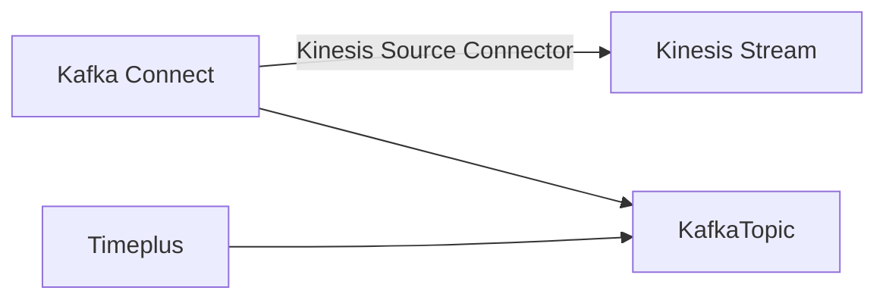

# 流传数据

Timeplus支持广泛的数据来源。

## 通过 web 控制台添加新源

### 从Apache Kafka加载流数据 {#kafka}

截至今天，Kafka是Timeplus的原始数据来源(和汇)。 通过与Confluent的强大伙伴关系，我们可以将来自Confluent Cloud、Confluent Platform或Apache Kafka的实时数据加载到TimePlus流式引擎。 (最近引入了一个新功能来创建 [个外部流](working-with-streams#external_stream) 来分析Confluent/Kafka/Redpanda 中的数据而不移动数据)

#### 汇合式云

1. 点击 **从导航菜单中添加数据**。 然后点击 **Kafka** 并点击 **开始** 按钮
2. 指定此数据源的名称并提供可读的描述。
2. 选择Kafka部署类型的汇流云。
2. 指定 broker(s) URL，例如 `pkc-abc12.us-west-2.aws.confluent.cloud:9092`
4. 指定Kafka主题的名称。
4. 当您选择Confluent Cloud时， **SASL Plain** 会被自动选中。 输入您的集群的 API 密钥和秘密密钥。
4. 对于数据格式，我们目前支持JSON、AVRO和文本格式。 如果Kafka主题中的数据是JSON格式， 但模式可能随着时间的推移而变化，我们建议您选择文本格式。 这样整个JSON文件将被保存为字符串， 并且您可以使用 JSON 相关的函数来提取值，即使模式已更改。
4. 如果您选择AVRO，则有一个“自动提取”选项。 默认情况下它被关闭，意味着整个消息将被保存为字符串。 如果您开启，那么AVRO消息中的顶级属性将会放入不同的列中。 这对您更方便查询，但不支持模式进化。  当选择AVRO时，您还需要指定schema注册表的地址、API密钥和密钥。
5. 默认情况下，源可以在 Timeplus 中创建一个新流。 请指定新的流名称。 或者，您可以禁用流创建并从列表中选择一个现有的流。
7. 点击 **下一个** 预览来自指定的 Kafka 源的流量数据，并选择列作为事件时间。
8. 完成向导的其余部分和您的流数据将立即在新流中提供。

#### 自定义Kafka部署

类似于从 Confluent Cloud 加载数据的步骤。 您可能不需要指定 `SASL 纯` 作为身份验证方法。 请确保Timeplus能够与您的Kafka 经纪人联系。


#### Kafka源说明

请注意：

1. 目前我们只支持 JSON 格式的 Kafka 主题
2. 主题级别 JSON 属性将被转换为流列。 对于嵌套属性， 元素将被保存为 `字符串` 列，然后您可以用 [JSON 函数之一](functions#processing-json) 查询它们。
3. JSON消息中的数值或布尔值类型将被转换为流中的对应类型。
4. 日期时间或时间戳将被保存为字符串列。 您可以通过 [toTime 函数](functions#totime) 将它们转换为日期时间。


### 从 Apache Pulsar 加载流数据 {#pulsar}

Apache® PulsarTM 是一个云端、分发、开源消息和流式平台，用于实时工作量。 最近，Timeplus为Apache Pulsar添加了一流集成，既作为数据源又作为数据汇。

#### 支持的 Pulsar 版本、部署和身份验证

支持 Pulsar 2.9.0 或以上版本。

支持 Apache Pulsar 和 StreamNative 云。

:::info Note 支持StreamNative Cloud

为了连接到 StreamNative Cloud，您需要设置一个服务帐户。

1. 从左侧导航面板上选择“服务账户”(您需要在主页上选择一个实例来查看导航面板)。
2. 创建服务帐户，您不需要“超级管理员”权限。 如果您已经有一个，就跳过了。
3. 将主题的读取和/或写入权限 (取决于是否要创建一个源或汇) 到服务帐户 (或您可以拥有两个服务帐户) 一个待阅读，一个待写）。 这可以先选择"主题"，选择一个主题(或创建一个新的主题)，然后点击它。 然后单击"POLICIES "选项卡，然后将服务帐户添加到主题的“授权”列表中。
4. 返回“服务帐户”页面。  选择 Token 或 OAuth2。

:::

有三种支持的身份验证：

* 无。 调用 REST API 时将 `auth_type`设置为空字符串。 这通常只适用于本地Pulsar测试目的。
* OAuth2.  调用 REST API 以创建 Pulsar 源时，将 `auth_type`设置为 `oauth2`。 它得到StreamNative Cloud的支持。 在 `auth_params` payload中需要以下参数：
  * `必需的 issuer_url`
  * `必须有` 个对象
  * `需要私人密钥`
  * `需要 client_id`
  * `范围` 是可选的
* 令牌。  调用 REST API 以创建 Pulsar 源时，将 `auth_type`设置为 `token`。  也需要在  `auth_params` payload中设置 `token` key/value。 StreamNative Cloud也支持它。

#### 源配置

| 名称                             | 类型   | 需要吗？ | 默认      | 描述                                                                                           |
| ------------------------------ | ---- | ---- | ------- | -------------------------------------------------------------------------------------------- |
| 经纪网址                           | 字符串  | Y    |         | Pulsar 经纪人的 URL，例如 `pulsar://localhost:6650` 用于不安全的连接， `pulsar+ssl://localhost:6651` 用于安全连接。 |
| 主题                             | 字符串  | Y    |         | 主题名称，例如： `持久性主题/tenant/tope` 用于持久性主题， `非永久性主题/tope` 用于非持久性主题。                                |
| 连接超时                           | 持续时间 | N    | `“5”`   | 建立TCP连接超时。                                                                                   |
| tls_allow_pensure_connection | 布尔值  | N    | `false` | 配置是否从 Pulsar 客户端接受不信任的 TLS 证书。                                                               |
| tls_validate_hostname        | 布尔值  | N    | `false` | 配置 Pulsar 客户端是否验证来自经纪人的主机名的有效性。                                                              |
| 开始位置                           | 字符串  | N    | `“最新”`  | 配置源来读取来自主题的 `"最早"` 消息或 `"最晚"`                                                                |
| 消息解码器                          | 字符串  | N    | `"文本"`  | 配置如何解码消息，要么 `"text"` 或 `"json"`。                                                             |
| 接收队列大小                         | 整数   | N    | `1000`  | 设置消费者接收队列的大小。 使用更高的价值就有可能增加消费量，而牺牲对内存的更大利用。                                                  |

### 从 Kinesis 加载流式数据 {#kinesis}

如果您的流式数据流在 [Amazon Kinesis 数据流](https://aws.amazon.com/kinesis/data-streams/)中，您可以分两步加载它们到 Timeplus。

1.  首先通过 [将Kinesis 源连接器为 Confluent Cloud](https://docs.confluent.io/cloud/current/connectors/cc-kinesis-source.html) 或 [Amazon Kinesis 源连接器将Kinesis 数据加载到 Kafka 主题](https://docs.confluent.io/kafka-connect-kinesis/current/overview.html)
2. 使用 Timeplus 上面的Kafka 源将数据加载到流中。

数据流可以用以下方式说明：




### 上传本地文件

如果您有一些静态数据集或查找CSV格式的表，您可以直接上传文件到Timeplus。

1. 点击 **从导航菜单中添加数据**。 然后点击 **文件** 并点击 **开始** 按钮
2. 从您的本地文件系统拖放一个 CSV 文件来上传文件。 或者您可以指定一个用于下载文件的 Timeplus 的 URL。 目前我们只支持 CSV 格式。 其他格式不久将得到支持。
3. 指定此数据源的名称并提供可读的描述。
4. 与 Kafka 源相似，您可以选择创建一个新流或选择一个现有流。 通常，在第一行中，CSV文件包含列头部。 取消选中此选项，如果没有标题，则TimePlus将创建列名称。
5. 点击 **下一个** 预览流式数据并选择列作为事件时间。
6. 完成向导的其余部分和您的流数据将立即在新流中提供。


### 加载示例流数据

如果您没有准备好将您的真实数据加载到Timeplus中，或者只是想要与系统一起玩， 您可以使用此功能加载一些采样流数据。 我们提供了三个典型的蒸发数据

1. `iot_data` 将生成3台设备 (device_0, device_1 和 device_2) 的数据。 `数字` 值可以是 0 到 100 之间。 `时间` 列是事件生成的时间。
2. `user_logins` 将生成两个用户的数据(用户1和用户2)，可能来自 `城市` 值：上海或北京。 `时间` 列是事件生成的时间。
3. `devops` 将生成3 `主机名`(host_0,host_1, 和 host_2, 从 3 可能的 `区域`(eu-central-1, us-west-1, sa-east-1), 3 可能的 `机车`(1,2,3), 数字 `usage_user` 从 0 到 100 `用法系统` 从 0 到 100 和 `时间` 列为事件时间。

您可以通过 **添加数据** 菜单和 **示例数据** 选项加载这些样本数据。 您可以为数据创建新流或选择现有流。


## 通过第三方工具加载其他数据到 Timeplus

Timeplus可与数据生态系统合作，并可利用各种工具加载数据，甚至在摄取时进行数据转换。


### Airbyte

AirByte提供开放源码软件版本和管理云以收集数据、转换数据和发送到其他目的地。

高级别会议

1. AirByte 可以从许多不同的数据来源获取数据，包括数据库/DC或基础设施日志、应用程序日志，甚至商业应用程序(例如Salesforce)
2. 数据可以通过 AirByte 内置能力正常化。 或者可以先将其保存到目的地数据库，然后依靠dbt或其他工具进行转换/实现。
3. AirByte收集的数据可以发送到许多目的地，包括Timeplus。

只需命名来自Airby的几个数据源：

* 应用市场，如苹果应用商店
* AWS Cloudtrail
* Google BigQuery
* 使用 Gzip/Zip/xz/Snappy 压缩从 S3/GCS/SFTP/本地加载文件，在 CSV/JSON/XML/Excel/Parquet/etc
* Github, GitLab, or JIRA活动
* Google 广告
* Instagram 社交媒体
* Slack或微软团队
* PostgreSQL, RedShift, Snowflake, MongoDB, MySQL, Microsoft SQL Server, 等等。


:::info

Airbyte的 Timeplus 目标插件正处于早期阶段。 请联系我们来安排整合。

:::

### Kafka 连接器

您可以使用 Kafka Connector 将数据源中的数据加载到 Confluent Cloud, Confluent Platform, 或 Apache Kafka，然后使用 Timerplus 通过内置的Kafka Source将其加载到流中。

有几个可以通过Kafka Connects进入Timeplus的数据源例子。 详情请查看 https://www.confluent.io/product/confluent-connectors/。

* Apache ActiveMQ
* Amazon CloudWatch Logs
* [Amazon Kinesis](#kinesis)
* Amazon S3
* Amazon SQS
* Azure Blob Storage
* Azure Event Hubs
* CockroachDB CDC
* Databricks
* Github
* Google Cloud Pub/Sub
* IBM MQ
* InfluxDB
* JDBC
* Microsoft SQL Server
* MongoDB
* MQTT
* MySQL CDC
* Neo4j
* Oracle Database
* PostgreSQL CDC
* RabbitMQ
* Salesforce
* ServiceNow
* SFTP
* SNMP
* Splunk
* TiDB CDC
* Tigergraph
* Zendesk

### 直接通过 SQL 插入数据

Timeplus还提供数据库驱动程序，以便您也可以通过您最喜欢的 SQL 客户端连接到TimePlus并运行 SQL 以插入数据。

:::info

Timeplus数据库驱动程序处于早期阶段。 请联系我们来安排整合。

:::

```sql
INSERT INTO <stream_name> (<col_name_1>, <col_name_2>, ...)
VALUES
(<col_value_1>, <col_value_2>, ...), (<col_value_11>, <col_value_22, ...), ...
```

当将数据附加到目标流时，用户可以在任何顺序中指定所有列名或流的某些列名以插入数据。 如果只指定目标流的某些列名，质子将对未指定的列使用默认值。

示例：

```sql
INSERT INTO test(i, s) VALUES (1, 'hello'), (2, 'world'), (3, 'more');
```

