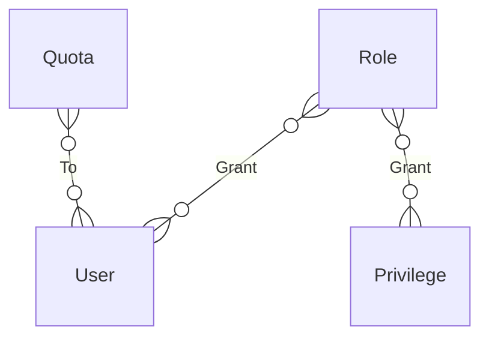

# Role-Based Access Control

Timeplus Enterprise supports access control management based on [RBAC](https://en.wikipedia.org/wiki/Role-based_access_control) approach.

You can configure the access entities via SQL. This works in both single node and cluster deployments.



## Roles

You can create roles and associate them with [Privileges](#privileges).

### Create an admin role

The following SQL creates the `admin` role and grant all permissions to it.

```sql
CREATE ROLE admin;
GRANT ALL ON *.* TO admin;
```

### Create a power user role

The following SQL creates the `power_user` role and grant all permissions of `default` database to it, also revoke the permission for this role to manage other roles or users.

```sql
CREATE ROLE power_user;
GRANT ALL ON default.* TO power_user;
REVOKE CREATE USER, DROP USER, ALTER USER, CREATE ROLE, DROP ROLE, ALTER ROLE ON *.* FROM power_user;
```

### Create a read only user role

The following SQL creates the `read_only` role and grant read permissions of `default` database to it.

```sql
CREATE ROLE read_only;
GRANT SELECT ON default.* TO read_only;
GRANT SHOW ON default.* TO read_only;
```

## Users

### Create a user

The following SQL creates a user and assign the specific role to it.

```sql
CREATE USER user_name IDENTIFIED WITH plaintext_password BY 'password';
GRANT user_name TO role_name;
```

### Drop a user

The following SQL drop the user. This won't delete the SQL resources created by the user.

```sql
DROP USER user_name;
```

## Privileges

### ALL

A special privilege to include all permissions.

### SELECT

Able to run `SELECT` on the specified streams or views, e.g.

```sql
GRANT SELECT ON test1 TO user1;
```

### 插入

Able to run `INSERT` on the specified streams, e.g.

```sql
GRANT INSERT ON test1 TO user1;
```

### ALTER COLUMN

Able to run `ALTER STREAM .. ADD COLUMN` or `ALTER STREAM .. DROP COLUMN`  on the specified streams, e.g.

```sql
GRANT ALTER COLUMN ON test1 TO user1;

ALTER STREAM test1 ADD COLUMN col2 string AFTER col1;
ALTER STREAM test1 DROP COLUMN col2;
```

### CREATE

Able to create new streams, views or materialized views, e.g.

```sql
GRANT CREATE ON *.* TO user1;
```

You can also specify the resource type, such as `GRANT CREATE USER`.

### DROP

Able to drop new streams, views or materialized views, e.g.

```sql
GRANT DROP ON *.* TO user1;
```

You can also specify the resource type, such as `GRANT DROP USER`.

### KILL QUERY

Able to kill a running query, e.g.

```sql
GRANT KILL QUERY ON *.* TO user1;

-- user1 kill other's running query
KILL QUERY WHERE query_id='xxx';
```

### ACCESS MANAGEMENT

Able to manage users, roles and row policies, e.g.

```sql
GRANT ACCESS MANAGEMENT ON *.* TO user1;

-- user1
CREATE USER user2;
```

## Row Policies

Currently row-based access control is available for historical query, not for streaming query yet.

例如：

```sql
-- create row policy for user1 to select rows with col1 != 'hidden' in stream 'test1'
CREATE ROW POLICY policy1 ON test1 FOR SELECT USING col1 != 'hidden' TO user1;

-- alter row policy to also attach to user2
ALTER POLICY policy1 ON test1 TO user1, user2;

-- allow other user to SELECT all rows on test1
CREATE ROW POLICY policy2 ON test1 USING 1 TO ALL EXCEPT user1;

-- view the row policy
SHOW POLICIES ON default.*;
SHOW CREATE ROW POLICIES policy1;

-- user1 could only view rows with col1 != 'hidden'
SELECT * FROM table(test1);
```

## Quota

Quota limits resource usage. Quota contains a set of limits for some durations, as well as a list of roles and/or users which should use this quota.

Management queries:

- CREATE QUOTA
- ALTER QUOTA
- DROP QUOTA
- SHOW CREATE QUOTA
- SHOW QUOTA
- SHOW QUOTAS

For example, the following SQL set the max query numbers per hour to 1, then change it to 10, and apply this to user1.

```sql
-- create and alter quota
CREATE QUOTA quota1 FOR INTERVAL 1 hour MAX queries = 1 TO user1;
ALTER QUOTA quota1 FOR INTERVAL 1 hour MAX queries = 10;

-- user1 run multiple queries and be blocked
SELECT * FROM test1;
```
