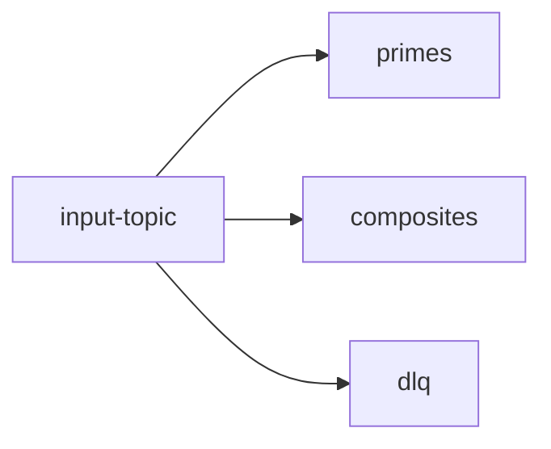

# Automation with Testcontainers

[Testcontainers](https://github.com/testcontainers/testcontainers-java) is a Java library that supports [JUnit](https://junit.org/) tests, providing lightweight, throwaway instances of common databases (including Timeplus), message brokers, or anything else that can run in a Docker container. You don't need to write docker-compose files, or call the Docker API, or mock the infrastructure by yourself. Simply run your test code, containers will be created and deleted automatically.

You can run any Docker images in Testcontainers. But starting from [Testcontainers v1.20.2](https://github.com/testcontainers/testcontainers-java/releases/tag/1.20.2), Timeplus module is supported out of the box. You can start an instance of Timeplus via:

```java
TimeplusContainer timeplus = new TimeplusContainer("timeplus/timeplusd:2.3.31";)
timeplus.start();
```

Compared to a [GenericContainer](https://java.testcontainers.org/features/creating_container/), you can call various methods on [TimeplusContainer](https://github.com/testcontainers/testcontainers-java/blob/main/modules/timeplus/src/main/java/org/testcontainers/timeplus/TimeplusContainer.java), such as setting the username, password, or run SQL queries with the default JDBC driver.

In this tutorial, we will walk through how to setup Apache Kafka and Timeplus via Testcontainers for Java, create a few Kafka topics, generate data, and apply streaming ETL and routing, and finally tear down the services. With [the GraalVM based native Kafka image](https://hub.docker.com/r/apache/kafka-native) and C++ based Timeplus, all of these operations can be done within 4 to 5 seconds.

The source code of the tutorial is available at [GitHub](https://github.com/timeplus-io/examples/tree/main/testcontainers). The data generator and demo scenario are inspired by Confluent's blog: [How to integration test a Kafka application with a native (non-JVM) Kafka binary with Testcontainers](https://developer.confluent.io/confluent-tutorials/kafka-native-testcontainers/kafka/)

## Set up the dependencies

We will be using [Gradle](https://gradle.org/), a popular open source build system for Java ecosystems. In the build.gradle file, we load the required dependencies, namly:

```gradle
dependencies {
    implementation 'org.apache.kafka:kafka-clients:3.8.0'
    testImplementation 'org.testcontainers:kafka:1.20.2'
    testImplementation 'org.testcontainers:timeplus:1.20.2'
    testRuntimeOnly 'com.timeplus:timeplus-native-jdbc:2.0.4'
}
```

Please load 1.20.2 or newer version of Testcontainers Kafka and Timeplus modules. If you need to run SQL to query Timeplus in your test code, please load the Timeplus JDBC driver via `com.timeplus:timeplus-native-jdbc:2.0.4` .

## Write test code

You don't need to write any code in the `src/main/java` folder since this tutorial only focuses on test automation. Create a Java source code under `src/test/java` folder, and use `org.junit.jupiter.api.Test` annotation to mark one function as a test case.

```java
package com.timeplus.examples;

import org.junit.jupiter.api.Test;

public class KafkaPrimalityRouterTest {

    @Test
    public void testPrimalityRouter() {
        ..
    }
```

### Start the Kafka container

As one of the best practices, you can start the Kafka test container in a try block, so that the container will be teared down automatically.

```java
    @Test
    public void testPrimalityRouter() {
            try (
            Network network = Network.newNetwork();
            KafkaContainer kafka = new KafkaContainer(
                "apache/kafka-native:3.8.0"
            )
                .withListener("kafka:19092")
                .withNetwork(network);
        ) {
            // Step 1: start Apache Kafka (we will start Timeplus container when data is ready)
            kafka.start();
```

Please note, we create a network object and set a listener for the Kafka broker, so that our Timeplus instance can access to the Kafka broker without hardcoding the IP address.

### Create Kafka topics

We will be using multiple Kafka topics. One topic for the input, literally `input-topic` . If the number is a prime, put it in the `primes` topic. If the number is not a prime, put it in the `composites` topic. If the data is not a number, which is not supposed to happen, put the data in the `dlq` topic (Dead Letter Queue), which is a common practice to handle dirty data or retries.



There could be many ways to create Kafka topics, such as using Shell command or using tools like kcat. Since we are writing Java code, the easiest solution will be using Kafka AdminClient to create the topics programmatically.

```java
           // Step 2: create topics
            try (
                var admin = AdminClient.create(
                    Map.of(
                        AdminClientConfig.BOOTSTRAP_SERVERS_CONFIG,
                        kafka.getBootstrapServers()
                    )
                )
            ) {
                admin.createTopics(
                    List.of(
                        new NewTopic(INPUT_TOPIC, 1, (short) 1),
                        new NewTopic(PRIME_TOPIC, 1, (short) 1),
                        new NewTopic(COMPOSITE_TOPIC, 1, (short) 1),
                        new NewTopic(DLQ_TOPIC, 1, (short) 1)
                    )
                );
            }
```

Since we are running the Kafka broker without authentication, you can retrieve the bootstrap URLs with Testcontainers `kafka.getBootstrapServers()` method, then use AdminClient to create 4 topics with 1 partition and 1 replica.

### Put 1..100 to the input topic

For the happy path testing, we will generate numbers from 1 to 100 to the input topic.

```java
            // Step 3.1: produce 100 ints that should go to prime / composite topics
            try (
                final Producer<Integer, Integer> producer = buildProducer(
                    kafka.getBootstrapServers(),
                    StringSerializer.class
                )
            ) {
                for (int i = 1; i <= 100; i++) {
                    ProducerRecord record = new ProducerRecord<>(
                        INPUT_TOPIC,
                        "" + i,
                        "" + i
                    );
                    producer.send(record);
                }
            }
            ...
    protected static Producer buildProducer(
        String bootstrapServers,
        Class serializerClass
    ) {
        final Properties producerProps = new Properties() {
            {
                put(ProducerConfig.BOOTSTRAP_SERVERS_CONFIG, bootstrapServers);
                put(
                    ProducerConfig.KEY_SERIALIZER_CLASS_CONFIG,
                    serializerClass
                );
                put(
                    ProducerConfig.VALUE_SERIALIZER_CLASS_CONFIG,
                    serializerClass
                );
            }
        };

        return new KafkaProducer(producerProps);
    }
```

The number will be saved as a string as both key and value for the Kafka message.

### Put a dirty message in the input topic

We will also put our favorite `hello world` string in the input topic to test our error handling.

```java
            // Step 3.2: produce strings to test DLQ routing
            try (
                final Producer<String, String> producer = buildProducer(
                    kafka.getBootstrapServers(),
                    StringSerializer.class
                )
            ) {
                ProducerRecord record = new ProducerRecord<>(
                    INPUT_TOPIC,
                    "hello",
                    "world"
                );
                producer.send(record);
            }
```

### Start Timeplus container

Now let's start the Timeplus container to process the data and validate the data pipeline.

```java
            // Step 4: start Timeplus container and run init.sql to create ETL pipelines
            TimeplusContainer timeplus = new TimeplusContainer(
                "timeplus/timeplusd:2.3.31"
            )
                .withNetwork(network)
                .withInitScript("init.sql"); // inside src/test/resources
            timeplus.start();
```

Please note

1. `timeplus/timeplusd:2.3.31` is the latest build as the time of writing. Feel free to change it to a newer version, if available.

2. We attach the same network to the Timeplus container, so that they can access to each other.

3. `withInitScript` method is called to setup Timeplus

### Define stream processing logic in Timeplus

We will create a `init.sql` file under `src/test/resources`, so that the file is available at runtime classpath.

#### Create Kafka external streams

First we will create 4 [Kafka External Streams](/proton-kafka) so that we can read data and write data.

```sql
CREATE EXTERNAL STREAM input(raw string)
SETTINGS type='kafka', brokers='kafka:19092',topic='input-topic';

CREATE EXTERNAL STREAM primes(raw string,_tp_message_key string default raw)
SETTINGS type='kafka', brokers='kafka:19092',topic='primes';

CREATE EXTERNAL STREAM composites(raw string,_tp_message_key string default raw)
SETTINGS type='kafka', brokers='kafka:19092',topic='composites';

CREATE EXTERNAL STREAM dlq(raw string)
SETTINGS type='kafka', brokers='kafka:19092',topic='dlq';
```

请注意：

1. `brokers` are set to 'kafka:19092', since Kafka and Timeplus containers are running in the same docker network.

2. Kafka External Stream in Timeplus is bi-directional. You can read Kafka data by `SELECT.. FROM` or write data to Kafka via `INSERT INTO` or Materialized View target stream.

3. For `primes` and `composites` external streams, we also defined the [_tp_message_key](/proton-kafka#_tp_message_key) virtual column to write the message key. The default key value is set to the message value.

#### Create a JavaScript UDF to check prime numbers

There is no built-in SQL functions to determine whether a number is a prime or not. This can be done via defining a [JavaScript UDF](/js-udf) in Timeplus, as following:

```sql
CREATE FUNCTION is_prime(values int8)
RETURNS bool
LANGUAGE JAVASCRIPT AS $$
    function _check_prime(num, limit){
        for (let start = 3; start <= limit; start += 2) {
            if (0 === num % start) {
                return false;
            }
        }
        return num > 1;
    };
    function is_prime(values) {
        var bools=[]
        for(let i=0;i<values.length;i++) {
            var number=values[i];
            bools.push(number === 2 || number % 2 !== 0 && _check_prime(number, Math.sqrt(number)));
        }
        return bools;
    }
$$;
```

请注意：

1. the input type is a `int8` or a small int, since our test data will be from 1 to 100.

2. the return type is a `bool`, either `true` or `false`

3. To improve performance, Timeplus will batch the input values. That's why in the `is_prime` method, the `values` is an array of `int8`. You can check whether they are prime and put the result as an array of `bool`.

4. The algorithm of how to check the prime is based on [the discussion on stackoverflow](https://stackoverflow.com/questions/17389350/detecting-prime-numbers-in-javascript)

#### Create materialized views to process data

Materialized Views in Timeplus are long-running queries. It leverage the full power of streaming SQL reading from any number of sources, versus just acting on the block of data inserted into a source ClickHouse table.

Fist let's handle the case if the input value is not a number, this can be done via the following SQL:

```sql
CREATE MATERIALIZED VIEW mv_dlq INTO dlq AS
SELECT raw FROM input WHERE _tp_time>earliest_ts() AND to_int8_or_zero(raw)=0;
```

请注意：

1. This materialized view reads data from `input-topic` via the `input` Kafka External Stream. We set `_tp_time>earliest_ts()` in the `WHERE` clause so that all existing messages in the Kafka topic will be read.

2. `to_int8_or_zero(string)` is a built-in SQL function to parse the string as a `int8`. If it fails, the function will return 0. Then we put the data into the `dlq` topic.

3. `INTO dlq` informs the materialized view to send results to the specific target, instead of using the materialized view internal storage.

Similarly, we can define other Materialized Views to check whether the numbers are prime or not, then send them to correspondingly topics.

```sql
CREATE MATERIALIZED VIEW mv_prime INTO primes AS
SELECT raw FROM input WHERE _tp_time>earliest_ts() AND to_int8_or_zero(raw)>0 AND is_prime(to_int8_or_zero(raw));

CREATE MATERIALIZED VIEW mv_not_prime INTO composites AS
SELECT raw FROM input WHERE _tp_time>earliest_ts() AND to_int8_or_zero(raw)>0 AND NOT is_prime(to_int8_or_zero(raw));
```

The `is_prime` UDF is called after making sure the input value is a number.

### Validate the processing logic

Now back to the test code. We will create a Kafka Java Consumer to read from both `primes` and `composites` topics, to make sure

1. Each message in `primes` topic is a prime, etc.

2. Totally 100 messages in both `primes`and`composites` topics. No more, no less.

3. In the Dead Letter Queue topic, there is a `hello world` message.

We will call the `buildConsumer` to set up a Kafka Java Consumer with `StringDeserializer`, and use JUnit assert.. methods to validate the results.

```java
            // Step 5: validate prime / composite routing
            try (
                final Consumer<String, String> consumer = buildConsumer(
                    kafka.getBootstrapServers(),
                    "test-group-id",
                    StringDeserializer.class
                )
            ) {
                consumer.subscribe(List.of(PRIME_TOPIC, COMPOSITE_TOPIC));

                int numConsumed = 0;
                for (int i = 0; i < 10 && numConsumed < 100; i++) {
                    final ConsumerRecords<String, String> consumerRecords =
                        consumer.poll(Duration.ofSeconds(5));
                    numConsumed += consumerRecords.count();

                    for (ConsumerRecord<
                        String,
                        String
                    > record : consumerRecords) {
                        int key = Integer.parseInt(record.key());
                        String expectedTopic = isPrime(key)
                            ? PRIME_TOPIC
                            : COMPOSITE_TOPIC;
                        assertEquals(expectedTopic, record.topic());
                    }
                }
                assertEquals(100, numConsumed);

                // make sure no more events show up in prime / composite topics
                assertEquals(0, consumer.poll(Duration.ofMillis(200)).count());
            }

            // valdate DLQ routing
            try (
                final Consumer<String, String> dlqConsumer = buildConsumer(
                    kafka.getBootstrapServers(),
                    "test-group-id",
                    StringDeserializer.class
                )
            ) {
                dlqConsumer.subscribe(List.of(DLQ_TOPIC));

                int numConsumed = 0;
                for (int i = 0; i < 10 && numConsumed < 1; i++) {
                    final ConsumerRecords<String, String> consumerRecords =
                        dlqConsumer.poll(Duration.ofSeconds(5));
                    numConsumed += consumerRecords.count();

                    for (ConsumerRecord<
                        String,
                        String
                    > record : consumerRecords) {
                        assertEquals("world", record.value());
                    }
                }
                assertEquals(1, numConsumed);

                // make sure no more events show up in DLQ topic
                assertEquals(
                    0,
                    dlqConsumer.poll(Duration.ofMillis(200)).count()
                );
            }
```

### Tear down Kafka and Timeplus containers

At the end of the test code, tear down Timeplus first then Kafka.

```java
            timeplus.stop();
            kafka.stop();
```

## Run the test

Just run `gradle test` in the `testcontainers` folder, if you have the Gradle CLI configured.

```
gradle test

> Task :test
..

BUILD SUCCESSFUL in 4s
4 actionable tasks: 1 executed, 3 up-to-date
```

It's amazing that only 4 seconds are spent to start Kafka and Timeplus containers, create topics, send test data, setup & verify the data pipeline, and tear down everything.
