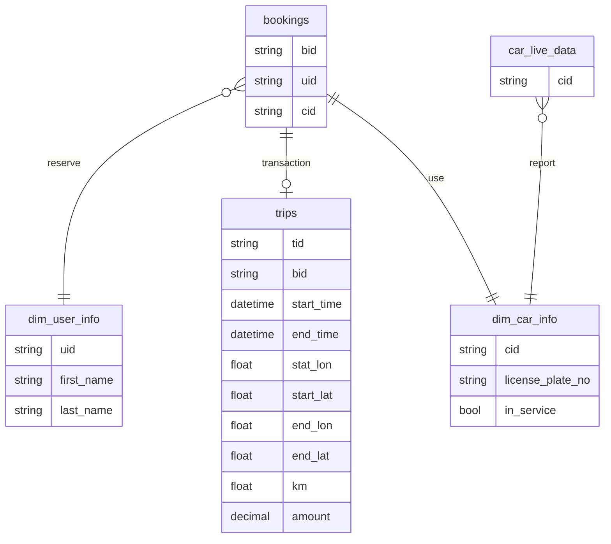
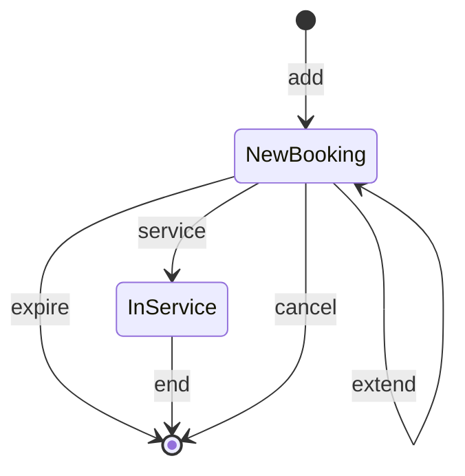

# Query Patterns

import Tabs from '@theme/Tabs';
import TabItem from '@theme/TabItem';

This document demonstrates some typical query patterns that you can achieve in Timeplus to solve various use cases. You can also check the subpages for some of the highlighted query recipes.

## 客户场景和数据模型 {#model}

您是一个carsharing 公司的主要业务分析员。 每辆汽车上都配备了传感器，以报告汽车位置。 客户使用移动应用程序在附近找到可用的汽车，预订它们，解锁它们并走上道路。 在旅行结束时，客户停车场将车锁定，行程结束。 付款将使用注册信用卡自动进行。

有些典型的用来进行时间敏感的见解的案例有：

* 在某个地点有多少辆汽车是由用户驾驶的？ 我们是否需要将一些汽车从不太繁忙的地点搬到这些热点地区？
* 哪些车驾驶得太快或燃料不足? 服务小组可能需要采取行动。
* 哪些用户继续预订汽车，然后取消它们？ 我们应向这些用户发送实时通知，以避免滥用。

系统中有多个数据流：





### dim_user_info

使用所有注册用户信息的相对静态流。

| 列      | 类型  | 示例值             |
| ------ | --- | --------------- |
| uid    | 字符串 | u00001          |
| 名字     | 字符串 | Foo             |
| 姓名     | 字符串 | 条形图             |
| 电子邮件地址 | 字符串 | a@timeplus.io   |
| 信用卡    | 字符串 | 371712345678910 |
| 两性平等   | 字符串 | F               |
| 生日     | 字符串 | 1990-01-15      |

### dim_car_info

所有注册汽车的相对静态流

| 列            | 评论                   | 类型   | 示例值      |
| ------------ | -------------------- | ---- | -------- |
| cid          | 汽车ID                 | 字符串  | c0000001 |
| 许可证-plate_no |                      | 字符串  | KM235L   |
| in_service   | 如果汽车被停车时出现错误(重试或维修中) | bool | 真的       |

### 汽车直播数据

来自汽车传感器的最新数据流。 当汽车引擎启动时，每秒汇报数据。 否则，每半小时报告数据。

| 列       | 评论                    | 类型    | 示例值                     |
| ------- | --------------------- | ----- | ----------------------- |
| 时间      | 传感器数据的日期时间            | 日期时间  | 2022-01-12 23:00:58.476 |
| cid     | 汽车ID                  | 字符串   | c0000001                |
| 经度      | 当前位置                  | float | 40.75896                |
| 纬度      | 当前位置                  | float | -73.985195              |
| 气体百分比   | 气体含量百分比，100表示满载罐体     | 小数    | 86.12                   |
| 速度 _kmh | KM/小时当前行驶速度           | 整数    | 56                      |
| 总公里数    | 这辆车的总距离以公里计。 在旅行后继续增加 | float | 3536                    |
| 已锁定     | 汽车是否被锁定               | bool  | 真的                      |
| 在使用     | 是否有人正在使用这辆车           | bool  | 真的                      |

### 预订

带有行程详细信息和付款信息的数据流。 在预订生命周期内生成每一行

* 当用户预订汽车时，一个带动动作=add的新事件，当前预订时间=过期=现在+30分钟
* 当用户解锁汽车时，一个带动动作=服务的新事件
* 当用户完成行程并锁定汽车时，一个带动动作=end 的新事件
* 当用户取消预订时，一个带动动作=取消的新事件
* 当用户将预订再延长30分钟时, 一个新的事件, 动作=extend, 并更新过期字段
* 如果用户不在到期前解锁汽车，则添加动作=过期的新事件




| 列    | 评论                    | 类型   | 示例值                     |
| ---- | --------------------- | ---- | ----------------------- |
| 时间   | 事件发生时                 | 日期时间 | 2022-01-12 13:00:58.476 |
| bid  | 预订ID                  | 字符串  | b00001                  |
| 预订时间 | 当用户预订汽车时。 30分钟后过期     | 日期时间 | 2022-01-12 13:30:58.476 |
| uid  | 用户 ID                 | 字符串  | u00001                  |
| cid  | 汽车ID                  | 字符串  | c0000001                |
| 行动   | 值之一：添加、取消、扩展、服务、过期、结束 | 字符串  | 添加                      |
| 过期   | 预订到期时                 | 日期时间 | 2022-01-12 13:30:58.476 |

### 旅行

带有行程详细信息和付款信息的数据流。 每行在行程结束时生成

| 列       | 评论         | 类型    | 示例值                     |
| ------- | ---------- | ----- | ----------------------- |
| tid     | 行程 ID      | 字符串   | t00001                  |
| 开始时间    | 行程开始时      | 日期时间  | 2022-01-12 13:00:58.476 |
| 结束时间    | 行程结束时      | 日期时间  | 2022-01-12 24:00:58.476 |
| bid     | 预订ID       | 字符串   | b00001                  |
| 起始lon   | 开始位置       | float | 40.75896                |
| 起始纬度    | 开始位置       | float | -73.985195              |
| end_lon | 结束位置       | float | 42.75896                |
| 尾部      | 结束位置       | float | -71.985195              |
| 距离      | 行驶距离为千米    | float | 23.2                    |
| 金额      | 用户应该支付多少行程 | 小数    | 40.75                   |

以下各节显示如何查询Timeplus以了解业务。

## 流分析 {#streaming}

### S-TAIL：显示含有或无过滤条件的原始数据 {#s-tail}

**使用案例：** 开始数据探索，分析员想要显示所有最近报告的汽车iot数据

```sql
SELECT * FROM car_live_data
```

或集中注意哪些汽车几乎没有气体（这样他们就可以派遣服务小组填充气体或停用汽车）

```sql
选择时间,cid,gas_per FROM car_live_data WHERE gas_per < 25 
```

结果：

| 时间                      | cid      | 气体百分比 | 在使用   |
| ----------------------- | -------- | ----- | ----- |
| 2022-01-12 23:00:58.476 | c0000001 | 18    | false |

### S-DOWNSAMPING：将详细数据点转换为高级数据 {#s-downsampling}

**用例：** 每辆车上的传感器可能会报告半秒到每 10 秒钟的数据。 分析员可能会降低颗粒度，仅需要将每分钟的数据保存到下行

```sql
SELECT window start,cid,avgggggas_percent,avg(speed_kmh) AS avg_spep FROM
tumbl(car_live_data,1m) GROUP BY window_start, cid
```

结果：

| 窗口开始                    | cid      | avg_gas_% | 平均速度 |
| ----------------------- | -------- | ----------- | ---- |
| 2022-01-12 23:01:00.000 | c0000001 | 34          | 35   |

更实际的情况是，用户可以创建一个 [实际化的视图](view#materialized-view) 来自动将下载的数据放入新的流/视图。

```sql
创建虚拟镜头作为
SELECT window_start as time,cid,avgggg_period AS avg_gas,avg(speed_kmh) AS avg_spep 
FROM tumbl(car_live_data,1m) GROUP BY window_start, cid
```

然后用户可以通过以下方式搜索数据

```sql
选择* 从 car_live_data_1分钟
```

结果：

| 时间                      | cid      | avg_gas | 平均速度 |
| ----------------------- | -------- | ------- | ---- |
| 2022-01-12 23:01:00.000 | c0000001 | 34      | 35   |


### S-AG-RECENT：显示最近数据的聚合 {#s-agg-recent}

**使用案例：** 分析员想要在过去一小时内监视总收入。

Timeplus提供了一个特殊的语法来轻松获取这种结果

```sql
从EMIT LAST 1小时的行程中选择总金额
```

一旦提交查询，它将根据过去的一天显示相当多的行，然后以流式方式显示新的结果。

结果：

| sum(金额) |
| ------- |
| 3500.42 |

有其他方法可以获得类似的结果，并且有更详细的查询

1. 我们可以在 1 小时窗口中对数据应用全局聚合。 `从结束时间 > date_sub(现在)，1h)` 的旅行中选择sum(金额)

2. 另一个解决方案是使用节点窗口聚合。 类似于 [S-DOWNSAMING](#s-downsampling) 的 `tumble` 窗口，数据按固定大小的时间窗口分组，这样的一个小时。 简易窗口不会相互重叠，所以最好是在不重复数据的情况下下下采样(例如， `计数` 聚合) 节点窗口不会被计数两次， 它将转到左边或右边（时间安排中的过去或未来）并带有滑动的步骤。 例如，下面的查询将使用连接窗口获得过去1小时的总收入， 结果将每秒发送一次。 `通过 window _start,window _end,sum(amount) 从chop(trips,end_time,1s,1h) 
组 window start,window _end`

### S-SESSION：用活跃会话分析活动 {#s-session}

**使用案例：** 分析员想要跟踪汽车的每日移动情况。 在发动机启动时，汽车上的传感器每隔两次报告数据， 并在引擎关闭时每半小时报告一次数据。 如果服务器5秒内没有收到运行车的数据，则该车被认为已断开。  我们可以运行以下查询来显示每辆运行中的汽车的行程距离

```sql
SELECT cid,window _start,window_end,max(total_km) AS trip_km 
FROM session(car_live_data, time,5s, cid)
GROUP BY __tp_session_id,cid,window_start, window
HAVING trip_km > 0
```

结果：

| cid    | 窗口开始                    | 窗口结束                    | trip_km             |
| ------ | ----------------------- | ----------------------- | ------------------- |
| c00040 | 2022-03-23 21:42:08.000 | 2022-03-23 21:42:12.000 | 0.05395412226778262 |
| c00078 | 2022-03-23 21:42:08.000 | 2022-03-23 21:42:33.000 | 0.4258001818272703  |

可以创建更复杂的查询，按汽车ID和行程结束时间汇总数据。

```sql
用 query_1 AS (
选择 cid,window start AS w_start,wind_end AS w_end,max(total_km) AS trip_km 
from session(car_live_data,time,20m,cid) 由 __tp_session_id, cid, window_start, wind_end

选择 cid,window_start,wind,sum(trip_km) 
从cid,wind,wind,1h) 组中选择 cid,window _start,window
```

结果：

| cid      | 窗口开始                    | 窗口结束                    | trip_km |
| -------- | ----------------------- | ----------------------- | ------- |
| c0000001 | 2022-01-12 00:00:00.000 | 2022-01-12 23:59:59.999 | 17.2    |
| c0000002 | 2022-01-12 00:00:00.000 | 2022-01-12 23:59:59.999 | 4.1     |

此查询是连续串流查询。 每小时(或每天(视可图窗口大小而定)，分析结果可以发送到电子邮件/Slacka版面或Kafka版面进一步处理。

### S-TIME-TRAVEL：回到过去并自那时起进行分析 {#s-time-travel}

**使用案例：** 分析员不需要继续观看流式图表或仪表板。 自那时起，他们可以回到过去的一段时间来进行流式分析。 这可能有助于他们更好地了解几个小时前发生的情况(例如午夜)。

例如，分析员想要理解用户如何预订2小时前

```sql
选择窗口启动，计数(*) 循环(预订，15m) 
WHERE action='add' GROUP By window_start 
EMIT LAST 2h
```

或者他们可以指定一个准确的时间戳，例如：

```sql
SELECT window_start,count(*) FROM tumble(bookings,15m) 
WHERE action='add' and _tp_time>='2022-01-12 06:00:00.000' GROUP BY window_start 
```

结果：

| 窗口开始                    | 计数(*) |
| ----------------------- | ----- |
| 2022-01-12 06:00:00.000 | 34    |
| 2022-01-12 06:15:00.000 | 23    |

不仅将对过去的数据进行分析，而且将不断处理最新的输入数据。

### S-MVIEW：创建实事求是的视图，保存最新的分析结果和缓存供其他系统查询 {#s-mview}

**使用案例：** 不同于传统的 SQL 查询，串流查询在用户取消之前永远不会结束。 分析结果一直被推送到Web UI或slack/kafka目的地。 分析家想要在 Timeplus 中运行高级流流查询，并将结果缓存为实际化视图。 这样他们可以使用常规的 SQL 工具/系统来获取流式洞察力作为普通表。 有针对性的看法也有助于对数据进行采样，以减少数据流量，供今后分析和储存。

```sql
创建今天的市场收入作为
从今天结束时间 > 今天的旅程中获得的总量(数量) ();

— — 在 Timeplus 或其他已连接的 SQL 客户端
SELECT * 来自今日收入
```

### S-DROP-LATE：丢弃晚期事件以获得实时聚合洞察力 {#s-drop-late}

**使用案例：** 流式数据可能由于网络延迟、iot传感器故障等多种原因而延迟到达。 当我们运行流式分析(例如每分钟付款)，我们根据他们的事件时间(当付款实际发生时)汇总数据， 而不是当TimePlus收到数据时，我们不想等待太晚的事件。

Watermark是流式处理世界中的一种常见机制，用来设定事件的时间间隔。 与其他系统不同，TimePlus使得在不明确制定水印政策的情况下识别晚期事件非常容易。

类似查询的查询

```sql
SELECT window_start,wind_end,sum(amount),count(*)
从tumbl(trips,end_time,1m) GROUP BY window_start,window
```

它将显示每分钟支付总额，例如：

| 窗口开始                    | 窗口结束                    | sum(金额) | 计数(*) |
| ----------------------- | ----------------------- | ------- | ----- |
| 2022-01-12 10:00:00.000 | 2022-01-12 10:01:00.000 | 200     | 42    |
| 2022-01-12 10:01:00.000 | 2022-01-12 10:02:00.000 | 300     | 67    |

考虑到两辆汽车于上午10时10分返还。 就旅程和旅行而言，这两者都应算入第一次窗口。 然而，出于某种原因，数据点旅程A在10:01:15抵达，TripB数据点于10:01:16抵达。 Timeplus将接受TripA数据并将其添加到第一个窗口合计，并且关闭第一个窗口。 水印将发送至 10:01:00。 所以当旅程B数据点到达时，它被认为太晚，不会在流式结果中进行计算。 但当我们运行一个历史查询时，它仍然可以使用。

| 数据点   | 活动时间                    | 到达时间                    | 备注                                                                                         |
| ----- | ----------------------- | ----------------------- | ------------------------------------------------------------------------------------------ |
| 行程    | 2022-01-12 10:00:10.000 | 2022-01-12 10:01:15.000 | 包含在第一个窗口中，触发水印变化                                                                           |
| tripB | 2022-01-12 10:00:10.000 | 2022-01-12 10:01:16.000 | 它的时间小于水印。 <br />第一个窗口已关闭(不接受更多数据)<br />数据被丢弃以进行流式分析。 <br />仍然可以通过历史搜索来分析 |


### S-WAIT-LATE：等待更多时间处理迟交的事件 {#s-wait-late}

**使用大小写：** 以便更高级地用于上述情况。 分析人员也许应该为晚期事件安排更多的时间。 这将使流式分析不那么实时，不过如果网络延迟不可预测，可以包括更多的数据点。

在类似的情况下，高级设置的查询是

```sql
SELECT window_start,window_end,sum(amount),count(*)
从tumbled(trips,end_time,1m) GROUP BY window start,window
EMIT AFTER WATERMARK and DELAY 30s
```

### S-TOP-K：获取每个流式窗口最常用的值 {#s-top-k}

**使用案例：** 分析家想要理解哪辆汽车每天或每小时最常被预订

```sql
选择窗口启动，top_k(cid,3) 从tumble中选择的公共汽车(预订，1h) 由窗口起始组
```

这将生成像这样的每日报告

| 窗口开始                    | 热门车                    |
| ----------------------- | ---------------------- |
| 2022-01-12 00:00:00.000 | ['car1','car2','car3'] |
| 2022-01-13 00:00:00.000 | ['car2','car3','car4'] |

### S-MAX-K：获取每个流式窗口的最大值 {#s-max-k}

**使用案例：** 分析家想要理解哪次旅行是每天最长的

```sql
选择窗口启动，最大窗口启动(数量、3,bid,距离)
```

这将生成像这样的每日报告

| 窗口开始                    | 最长旅行                                                     |
| ----------------------- | -------------------------------------------------------- |
| 2022-01-12 00:00:00.000 | [(7.62,'b01',13.8),(2.45,'b02',2.37),(12.66,'b03',22.6)] |

要获得第二长旅程的预订ID，您可以 `选择..,最长旅行[2].2 作为预订ID`

### S-MIN-K：获取每个流式窗口的最小值 {#s-min-k}

**使用案例：** 分析家想要理解哪次旅行每天最短。

```sql
选择窗口启动，最小_k(数量、3,bid,距离)
```

这将生成像这样的每日报告

| 窗口开始                    | 短旅程                                                       |
| ----------------------- | --------------------------------------------------------- |
| 2022-01-12 00:00:00.000 | [(2.56,'b06',3.10),(7.68,'b07',10.8),(10.24,'b08',15.36)] |

### S-OVER-TIME：为每个时间窗口的结果获取差异/差距 {#s-over-time}

**使用案例：** 和Timeplus, 分析家可以轻松地比较当前分钟数据和最后一分钟数据。

例如，用户想要了解每分钟使用多少辆汽车，以及它如何不同于最后一分钟

```sql
SELECT window_start,count(*) AS num_of_trips,
lag(num_of_trips) AS last_min_trips,num_of_trips-last_min_travel as get
FROM tumble(trips,1m) GROUP BY window_start
```

结果

| 窗口开始                    | 行程数 | 最后一次最小旅行 | 间距 |
| ----------------------- | --- | -------- | -- |
| 2022-01-12 10:00:00.000 | 88  | 0        | 88 |
| 2022-01-12 10:01:00.000 | 80  | 88       | -8 |
| 2022-01-12 10:02:00.000 | 90  | 80       | 10 |

这是一种非常强大和有益的能力。 除了比较最后的汇总结果外，分析员还可以比较过去的数据。 例如，这第二个在最后一分钟或最后一小时都是相同的第二个。

下面的查询按秒比较汽车传感器数据的数量，比较最后几米的事件数

```sql
SELECT window_start,count(*) AS num_of_events,
lag(window start,60) AS last_min,
lag(num_of_events,60) AS last_min_events
num_of_events-last_min_events AS gap,
concat(to_string(to_decimal(gap*100/num_of_events,2)), '%') AS 更改
FROM tumble(car_live_data,1s) GROUP BY window_start
```

查询一旦开始运行，头1分钟内只有新的结果可用。 然后我们可以从60个窗口返回结果，以便我们能够比较差异。

结果

| 窗口开始                    | 事件数 | 最后最小值                   | 最后几分钟事件 | 间距 | 更改     |
| ----------------------- | --- | ----------------------- | ------- | -- | ------ |
| 2022-01-12 10:01:00.000 | 88  | 2022-01-12 10:00:00.000 | 83      | 5  | 5      |
| 2022-01-12 10:01:01.000 | 80  | 2022-01-12 10:00:01.000 | 87      | -7 | -8.75% |

### S-UNION-STREAMS：将同一个方案中的多个流合并到单个流 {#s-union-streams}

**使用案例：** 在相同的数据模式中可能有一些数据流，但有意放入不同的数据流， 例如，某一城市或某一国家(例如业绩或条例方面的考虑因素)的一流活动。 我们想要合并数据以了解整个情况。

例如，共用汽车公司首先在温哥华公司开业。 然后将其扩展到不列颠哥伦比亚省维多利亚。 每个地方政府的管理要求都有两套系统。 总部希望展示两个城市的流媒体分析。

```sql
SELECT * 从 trips_vancouver
UNION
SELECT * From trips_votoria
```


### S-JOIN-STREAMS：同时查询多个数据流 {#s-join-streams}

**使用案例：** 数据不断变化，每种类型的变化数据都是一个流体。 一个常见的要求是同时查询多种类型的数据以丰富数据，获得更多的上下文并了解它们之间的关系。

例如，我们想要了解用户平均在每辆车上开车和开始行程之间的分钟数。 [预订](#bookings) 流和 [旅程中的预订信息](#trips) 流包含行程开始时间和结束时间

```sql
SELECT avg(gap) FROM
( SELECT
    date_diff('second', bookings.booking_time, trips.start_time) AS gap
  FROM bookings
  INNER JOIN trips ON (bookings.bid = trips.bid) 
     AND date_diff_within(2m, bookings.booking_time, trips.start_time)
) WHERE _tp_time >= now()-1d
```


## 我们可以为这个演示集运行的其他串流查询 {#other-queries}

### 获取在用汽车数量{#num-cars}

每辆车都会报告他们的状态到car_live_data stream, 包括 `in_use` bool 标志 对于同一辆车ID，它可能在 2 分钟前报告 `in_use=false` 2分钟前，然后报告 `in_use=true` 分钟之前。 然后应将这辆汽车视为在使用中。 我们不应该进行全球性的聚合，因为我们只关心目前的状况。 而不是累积的数据(每辆运行的汽车应每秒两次报告数据)。 `tumble` 窗口应该可以用1秒作为窗口大小。

```sql
选择窗口启动，计数(不同的cid) FROM tumble(car_live_data,1s) 
WHERE in_use GROUP BY window_start
```

### 按收入获得最高10辆汽车订单 {#top10cars}

我们或许想知道哪些汽车帮助公司赚取大部分收入，哪些汽车没有获得足够的收入。 这可以通过以下查询完成

```sql
旅游收入 
INNER JOIN 预订在旅程。 bid=预订。 id 
WHERE end_time > today() GROUP BY cid 
ORDER BY income DESC LIMIT 10
设置 query_mode='table'
```

结果就像这样：

| cid    | 收入     |
| ------ | ------ |
| c87850 | 675.9  |
| c30765 | 637.48 |
| c72990 | 487.36 |
| c00956 | 481.66 |
| c21898 | 479.64 |
| c96280 | 476.62 |
| c59872 | 461.2  |
| c51800 | 451.14 |
| c20995 | 445.48 |
| c04604 | 445.3  |

您可以通过从 `dim_car_info 查找汽车许可证牌来进一步丰富数据`

```sql
使用顶部10辆汽车(
  选择Cid,sum(数量) 从旅行中获得的收入 
INNER JOIN 预订在旅行中。 bid=预订。 id 
WHERE end_time > today() GROUP BY cid 
ORDER BY income DEC LIMIT 10

SELECT cited, evenue,license_plate_no FROM top10car 
INNER JOIN dim_car_info on top10cars. id=dim_car_info.cid
设置 query_mode='table'
```

结果是

| cid    | 收入     | 许可证-plate_no |
| ------ | ------ | ------------ |
| c30765 | 749.06 | OPIH21       |
| c87850 | 701.14 | 384K9Z       |
| c00956 | 522.66 | 3JHAYX       |
| c68812 | 497.12 | LR3AF9       |
| c51363 | 495.98 | B8UVY6       |
| c72990 | 487.36 | W6IZOB       |
| c91904 | 486.14 | LIHUZW       |
| c21898 | 479.64 | 1KTBIJ       |
| c20995 | 477.38 | 6GN7SP       |
| c96280 | 476.62 | YSK84J       |


## 数据转换/过滤/清理 {#data}

### T-MASK: Scrubing sensitive fields {#t-mask}

**使用案例：** 消除敏感数据(例如PII或支付信息)

在此示例中，在用户活动分析中只显示信用卡号码的第一位和最后四位数。

```sql
SELECT uid,replace_regex(credit_card,'(\\d{4}) (\\d*) (\\d{4})','\\1***\\3') AS 卡 
FROM user_info
```

结果：

| uid    | 卡           |
| ------ | ----------- |
| u00001 | 3717***8910 |

### T-DERIVE：计算来自原始数据的列 {#t-derive}

**使用案例：** 创建新列来合并原始数据中多列的信息。 或以其他格式转换某些列的数据以使其可以显示。

```sql
SELECT uid, concat(first_name,' ',last_name) AS ful_name,
year(today())-year(to_date(irthday)) AS age FROM user_info
```

结果：

| uid    | 全名  | 年龄 |
| ------ | --- | -- |
| u00001 | 页脚栏 | 32 |

### T-LOOKUP：将标识符转换为更易读的信息 {#t-lookup}

**使用案例：** 在检查车载IOT 数据时，我们想要将车载ID转换为车牌号码。

```sql
SELECT time，cid，c.license_plate_no AS license,gas_percent,speed_kmh FROM car_live_data 
INNER JOIN car_info c 
on car_live_data.cid=c.cid 
```

结果：

| 时间                      | cid      | 许可协议   | 气体百分比 | 速度 _kmh |
| ----------------------- | -------- | ------ | ----- | ------- |
| 2022-01-12 23:00:58.476 | c0000001 | KM235L | 55    | 50      |
